# Voice Games

A browser-based **voice-controlled English learning portal for children** (ages about
6-10). The child speaks the target English word to trigger every in-game action - **the
voice is the only controller**. No login, no install, and no accounts.

## Play now

**Live product (public, HTTPS):** https://scaredofthesix.github.io/voice-games/

Open it in **Google Chrome** (desktop or Android). The browser asks for microphone access
the first time a game starts listening - choose **Allow**. The hub below lists all ten
games; tap **Play** on any card to start.

> The GitHub Pages link may not open from some networks or regions without a VPN. This is
> an external GitHub availability restriction outside the team's control; you can always
> run the same build locally instead (see [For developers](#for-developers)).

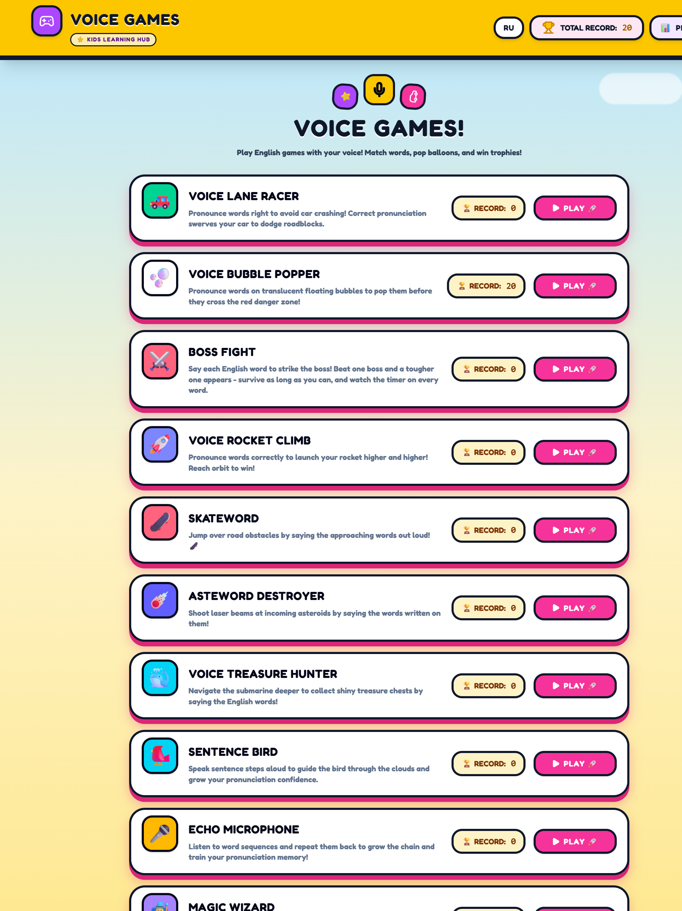

## How to play (example: Boss Fight)

Most games follow the same five steps.

**1. Choose a game.** Start from the Hub and press **Play** on a game card.

**2. Choose the vocabulary.** Select a built-in word set, or open **Add my own words**
before starting. Add one English word or phrase with its translation, or paste several rows
copied from two columns in **Google Sheets**. Column 1 is English and column 2 is the
Russian translation. The supported row formats are:

```text
English word<Tab>Russian translation
English word    Russian translation
```

`<Tab>` means the real tab character produced when two Google Sheets columns are copied,
not the five visible characters in the label. The second format uses exactly four ordinary
spaces. Three spaces, five spaces, commas, semicolons, and pipe characters are not
separators. For example:

```text
good morning<Tab>доброе утро
nice to meet you<Tab>приятно познакомиться
```

Valid rows are saved immediately. Invalid and duplicate rows stay in the input field with
a reason, such as **This word already exists.**, so the parent can correct them without
typing the whole row again. Multiple rows and Unicode translations are supported. CSV file
import is not used. Select **My words** after saving the new vocabulary.

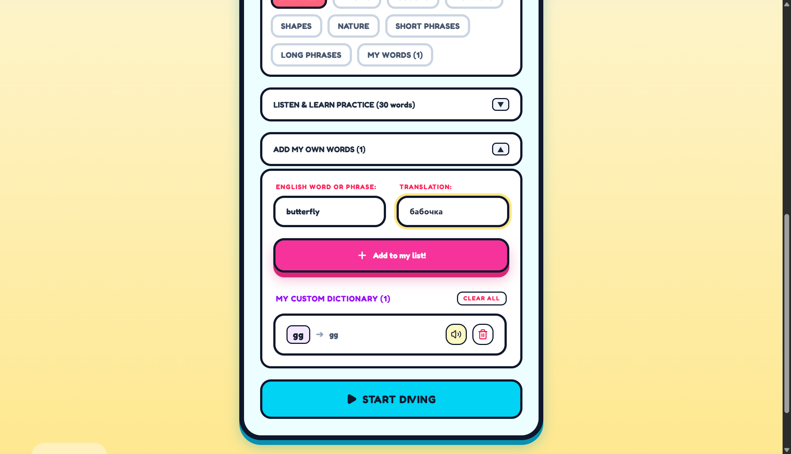

**3. Choose the difficulty.** Pick the difficulty, level length, or mode offered by that
game, then press its **Start** button.

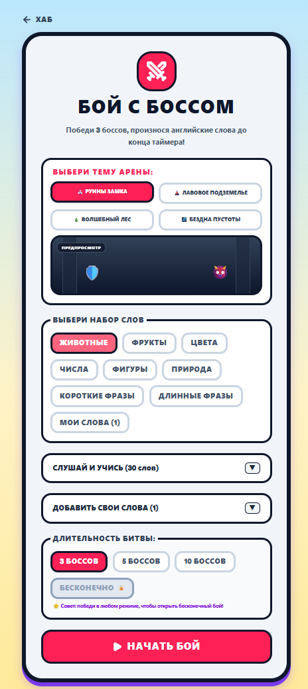

**4. Play with your voice.** The target word appears on the card (here, *Peach*). Say it
out loud and the game reacts. If you are not sure how it sounds, press **Listen (EN)** or
**Listen (RU)** first.

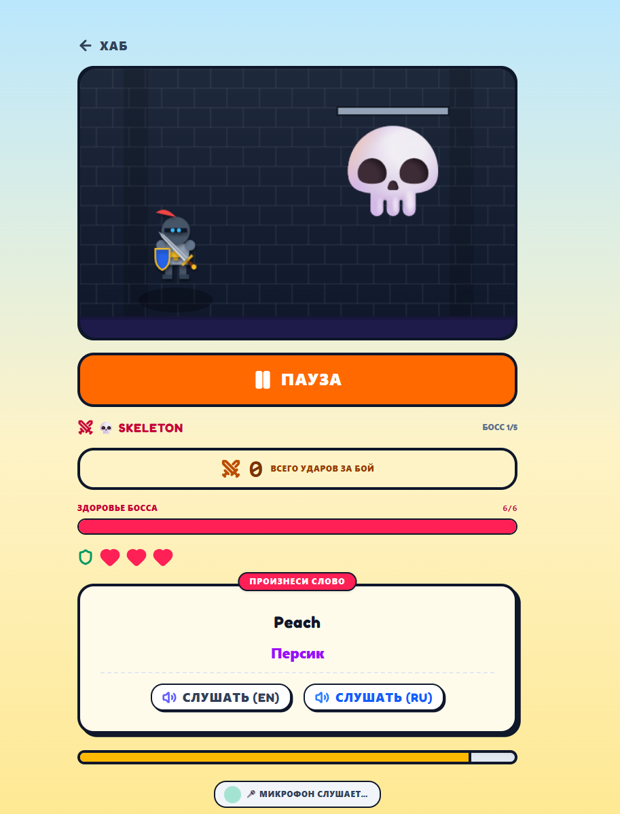

**5. Review the game result, then overall progress.** When the run ends, the result screen
shows only that run: its score, your personal high, and a per-word practice report (which
words were correct and which need more practice).

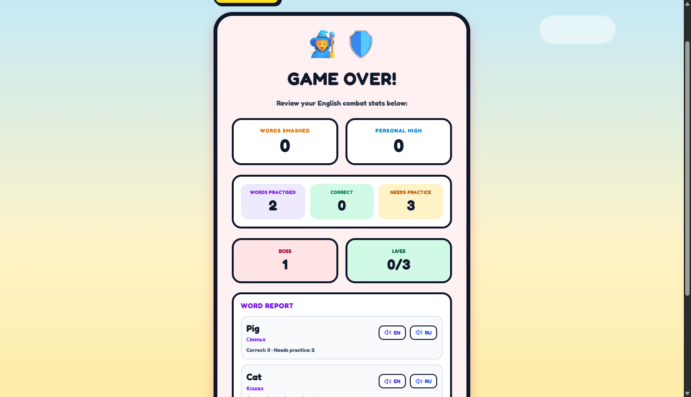

To see progress across all games, press **Back to hub** to return to the **Hub**, then press
**Progress** in the top-right corner. The Progress view shows sessions, high scores, and
practised words per game, and can export the data as CSV for a parent or teacher. CSV export
is separate from custom-word input.

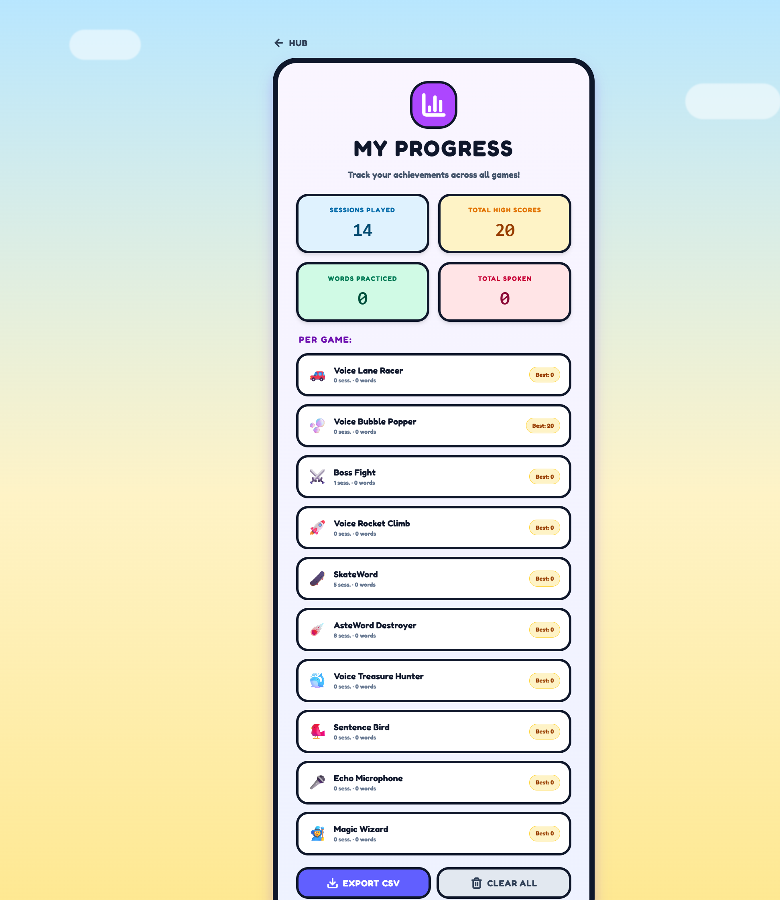

## Microphone help

- Use **Google Chrome**. Voice recognition is less reliable or unavailable in other
  browsers.
- When Chrome asks whether the site may use the microphone, choose **Allow**. If access was
  denied, open the site controls icon to the left of the address bar, allow **Microphone**
  for this site, then reload the page.
- Most games listen after their **Start** button is pressed and show a microphone/listening
  indicator. Wait for that indicator before speaking.
- Speak slowly and clearly. Wait for the game to process each word before saying the next
  one.
- **Sentence Bird is push-to-talk.** It does not listen in the background. Press
  **Click & say / Нажми и скажи**, click the active word card, or press **Space** once. Then
  speak while the green microphone indicator is active.
- **Echo Microphone** first reads the chain aloud with the microphone paused. When the
  screen changes to **Speak now**, it starts listening automatically. The memory cards hide
  the unanswered words. If the first recognition does not match, the retry message leaves
  the microphone active so the child can say it again; a lost attempt replays the same chain
  before the next round. Use **Replay Voice Guidance** to hear the whole chain again.

## The ten games

Each game trains pronunciation through a different mechanic:

1. **Voice Lane Racer** - dodge road obstacles by pronouncing words correctly.
2. **Voice Bubble Popper** - pop floating word bubbles before they reach the danger zone.
3. **Boss Fight** - say each word to strike the boss before the per-word timer runs out.
4. **Voice Rocket Climb** - launch a rocket higher with every correct word.
5. **SkateWord** - jump the skateboard over obstacles by saying the approaching words.
6. **AsteWord Destroyer** - shoot down asteroids by pronouncing the words written on them.
7. **Voice Treasure Hunter** - steer a submarine deeper to collect treasure chests.
8. **Sentence Bird** - guide a bird through the pipes by speaking the words.
9. **Echo Microphone** - repeat an increasingly long hidden word chain until the hearts run
   out.
10. **Voice Maze Quest** - choose clearly labelled voice routes, collect every crystal,
    go around the red hazard cell, unlock the large portal, and continue through new maze floors for
    an endless high score.

| Voice Lane Racer | Voice Bubble Popper |
|---|---|
| 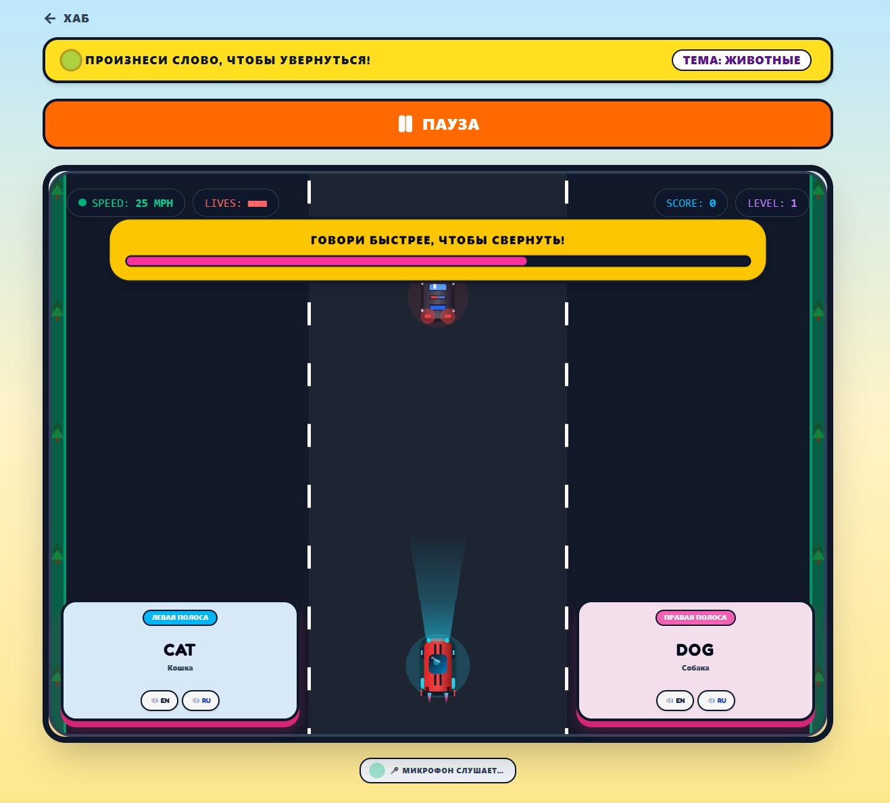 | 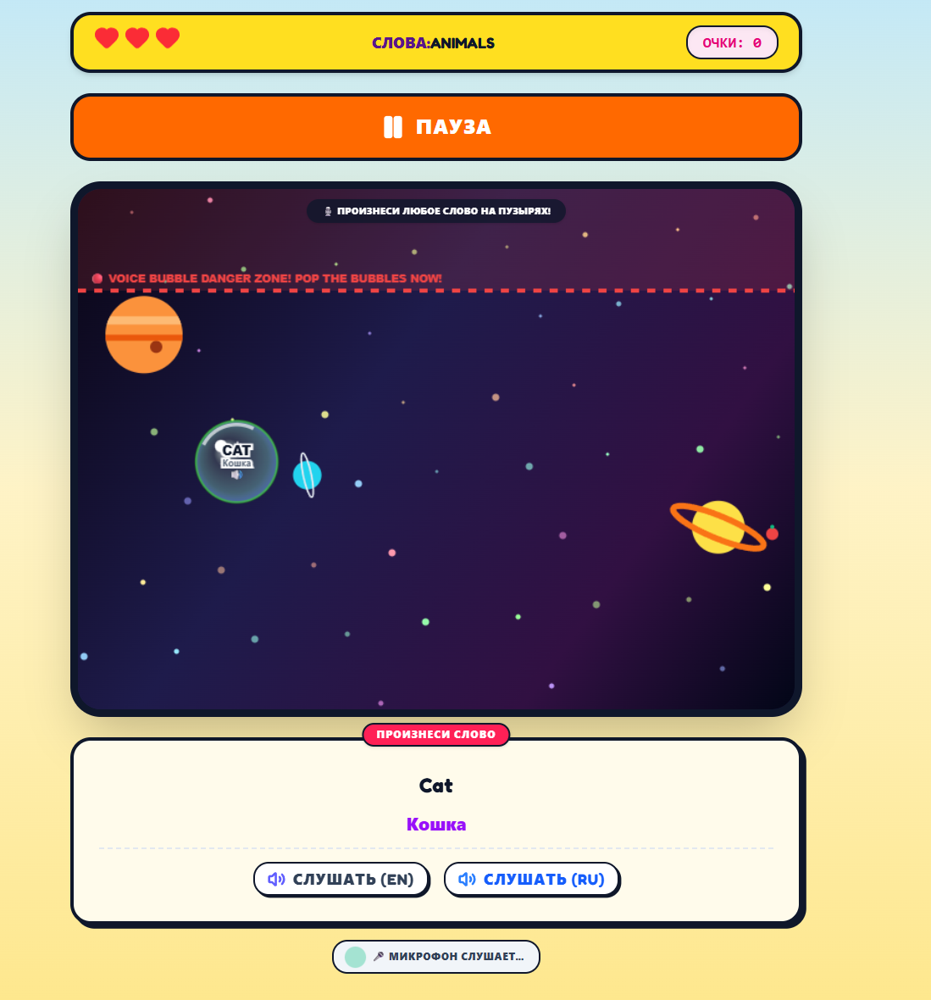 |
| **Boss Fight** | **Voice Rocket Climb** |
|  | 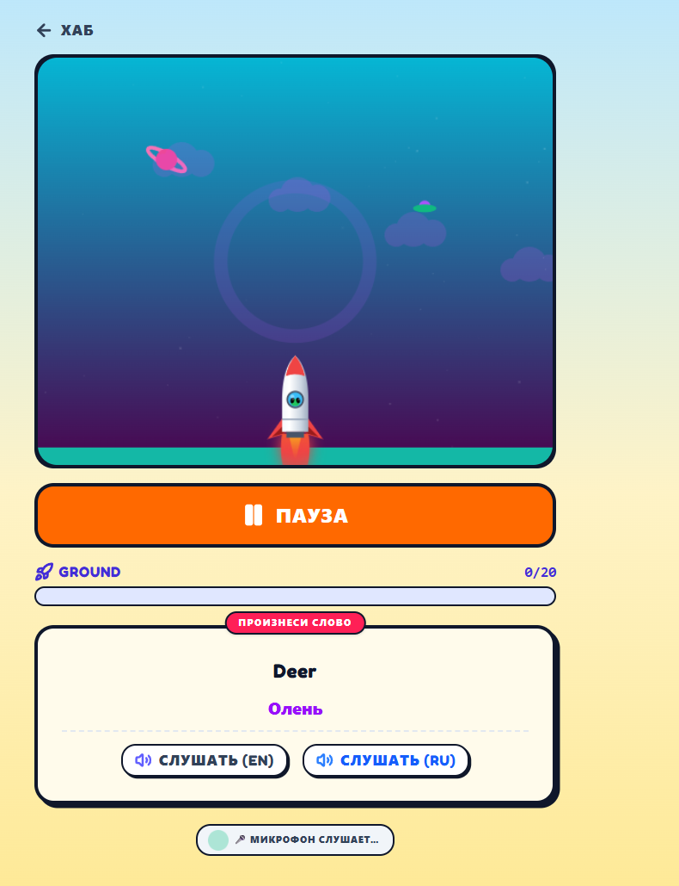 |
| **SkateWord** | **AsteWord Destroyer** |
| 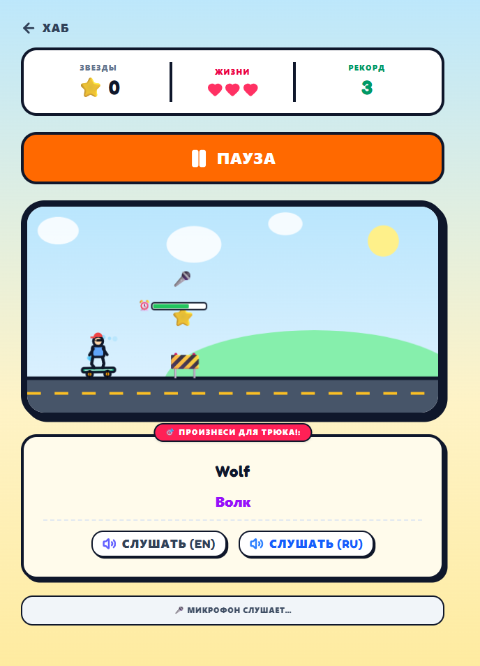 | 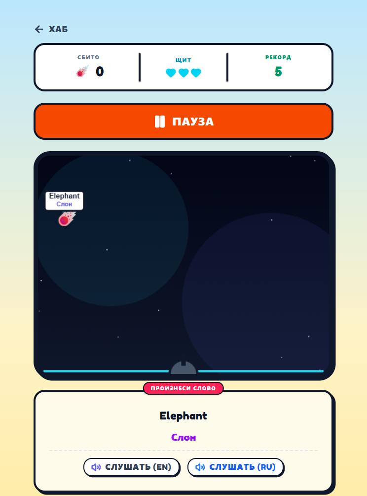 |
| **Voice Treasure Hunter** | **Sentence Bird** |
| 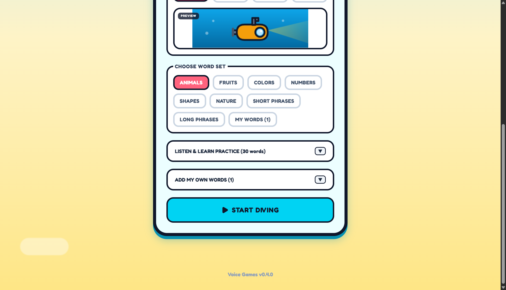 | 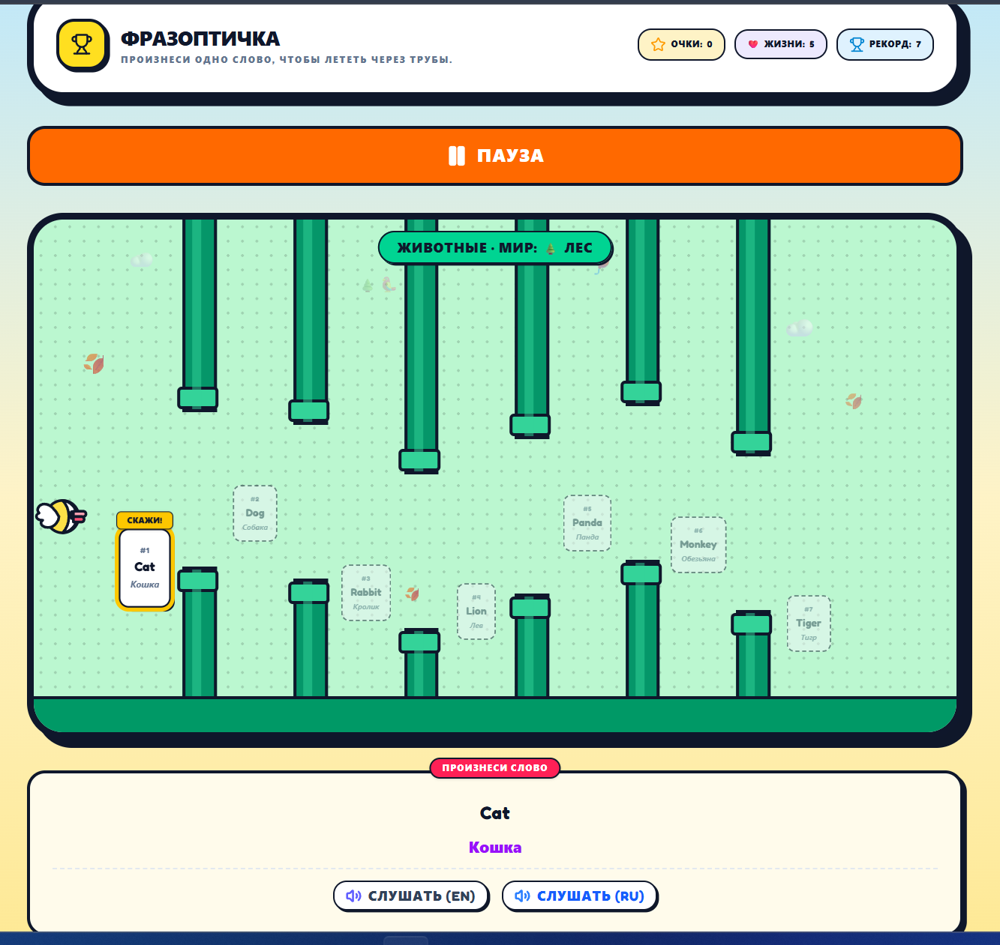 |
| **Echo Microphone** | **Voice Maze Quest** |
| 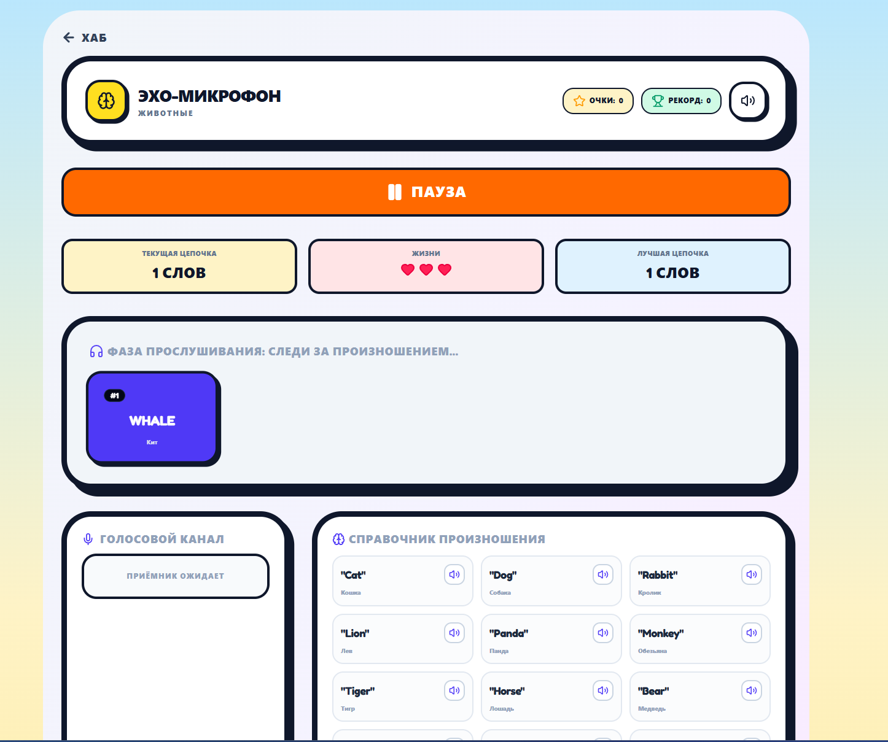 | 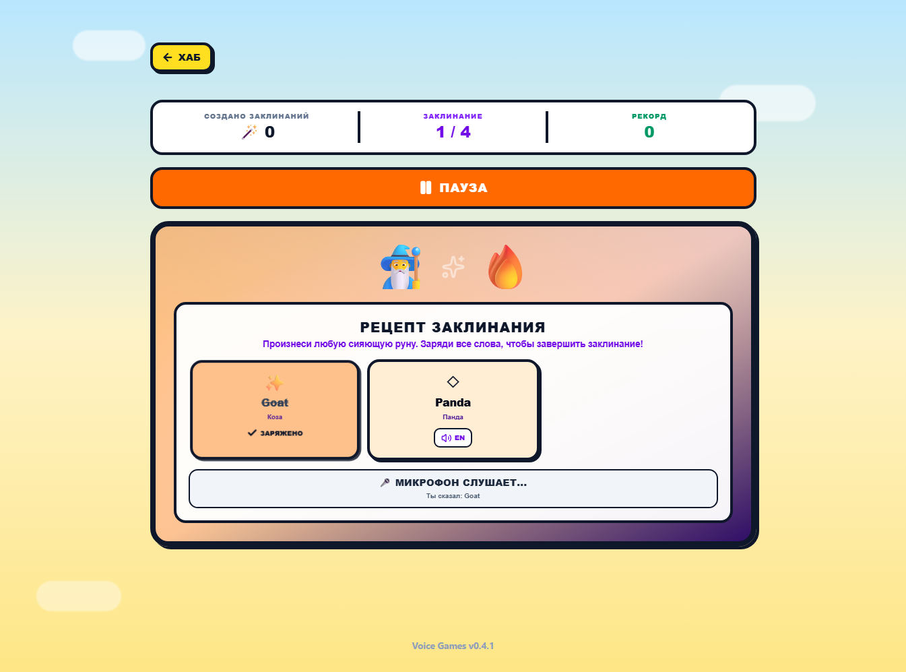 |

## Documentation

- **Hosted documentation:** <https://scaredofthesix.github.io/voice-games/docs/>
- **Repository documentation index:** [docs/README.md](./docs/README.md)
- **Customer handover** - current transition status, what is transferred vs. retained, and
  setup, recovery, and verification steps: [docs/customer-handover.md](./docs/customer-handover.md)
- **Administration and maintenance:** [docs/admin.md](./docs/admin.md)
- **Roadmap:** [docs/roadmap.md](./docs/roadmap.md)
- **Current Sprint Backlog:** [Sprint 5 milestone](https://github.com/scaredofthesix/voice-games/milestone/5)

## For developers

### Repository layout

```text
.
├── index.html              # Vite entry -> src/main.tsx
├── package.json
├── vite.config.ts
├── vitest.config.ts        # test runner + coverage thresholds
├── lighthouserc.json       # accessibility audit config
├── Dockerfile              # lightweight static-server image
├── src/
│   ├── App.tsx             # app shell, view routing (HUB + 10 games + PROGRESS)
│   ├── data.ts             # built-in word categories
│   ├── types.ts            # shared TypeScript types
│   ├── utils.ts            # speech synthesis, word matching helpers
│   ├── gameLogic.ts        # pure game rules shared across games + tests
│   ├── progress.ts         # per-word practice statistics, localStorage-backed
│   ├── voice/              # shared voice-recognition / anti-feedback engine
│   ├── useSpeechRecognition.ts  # Web Speech API hook
│   └── components/         # one file per game, plus GameCanvas, AudioVisualizer,
│                           # CustomWordsManager, ProgressView
├── docs/                   # documentation, architecture + ADRs, customer-handover.md
└── reports/                # course deliverables
```

### Tech stack

React 19 · Vite 6 · TypeScript 5.8.3 · Tailwind CSS v4 · Web Speech API · Web Audio API ·
Docker · Python (`http.server`)

### Setup and deployment

No API key is required - the game runs fully client-side. Voice recognition needs a secure
context (`localhost` or HTTPS); allow microphone access when prompted.

**Prerequisites:** Node.js 18+ and Google Chrome.

```bash
# Install dependencies
npm install

# Run the dev server (http://localhost:3000)
npm run dev

# Type-check / lint
npm run lint

# Run the automated tests (and coverage)
npm test
npm run test:coverage

# Production build / preview
npm run build
npm run preview
```

Continuous integration (type check, tests with coverage, build, and a Lighthouse
accessibility audit) runs on every pull request and on `main` via
[`.github/workflows/ci.yml`](./.github/workflows/ci.yml). See [docs/testing.md](./docs/testing.md).

**Public deployment (GitHub Pages).** After a change reaches `main`,
[`.github/workflows/deploy-pages.yml`](./.github/workflows/deploy-pages.yml) installs from
the lockfile, runs the type check and tests, builds with the project-page base path, and
publishes the verified result to the `gh-pages` branch. The manual recovery equivalent is:

```bash
MSYS_NO_PATHCONV=1 npx vite build --base=/voice-games/
cp dist/index.html dist/404.html   # SPA fallback
touch dist/.nojekyll               # disable Jekyll
npx -y gh-pages -d dist -b gh-pages
```

Every push or merge to `main` is deployed automatically. For self-hosting and internal
deployment details, see [docs/customer-handover.md](./docs/customer-handover.md) and
[docs/development-process.md](./docs/development-process.md).

### Contributing and AI-agent guidance

- [CONTRIBUTING.md](./CONTRIBUTING.md) - how to propose a change (setup, Definition of
  Done, conventions).
- [AGENTS.md](./AGENTS.md) - guidance for AI coding agents working in this repository.

### License

This project is released under the [MIT License](./LICENSE).
