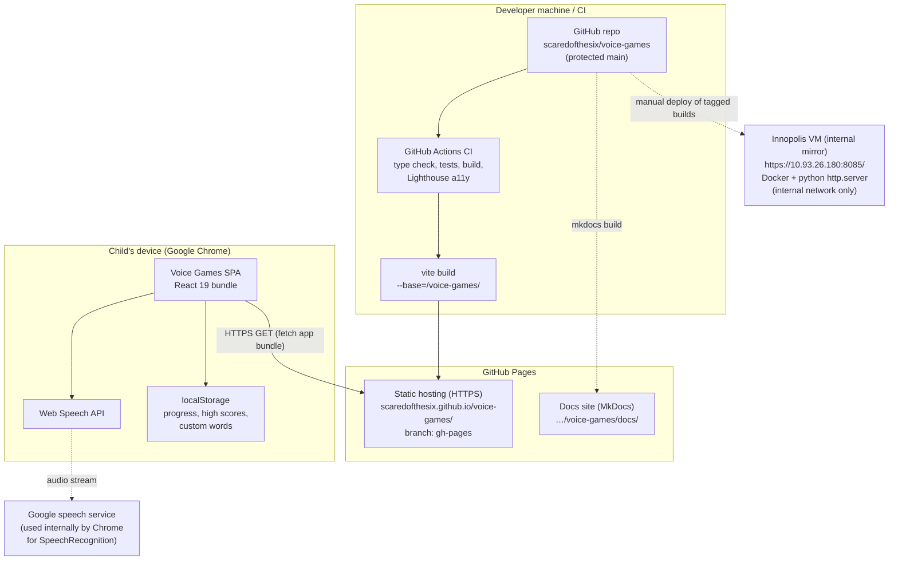

# Deployment view (Team 40)

Voice Games ships as a static single-page application. There is no application
server: after the bundle is downloaded, everything happens on the child's
device, except speech recognition itself, which Chrome may delegate to
Google's speech service.

## Notation

The diagram below is a [Mermaid flowchart](https://mermaid.js.org/syntax/flowchart.html),
not strict UML (customer feedback, issue #110):

- a **rounded rectangle** is a deployment node or artifact (a service, a
  stored bundle, a running process);
- a **large labeled box (subgraph)** groups nodes that live on the same
  machine or environment;
- a **solid arrow** is a runtime request or data flow, drawn **from the
  initiator to the responder** (client to server);
- a **dotted arrow** is a build-time or publish-time flow that happens only
  when the team ships something, not while a child plays.

## Deployment diagram



## Environments

| Environment | URL | Purpose | Updated by |
|---|---|---|---|
| Production | https://scaredofthesix.github.io/voice-games/ | Public deployment used by the customer and for UAT | Verified pushes to `main` via `.github/workflows/deploy-pages.yml`; manual publish is recovery only |
| Hosted docs | https://scaredofthesix.github.io/voice-games/docs/ | MkDocs view of the maintained [documentation source](../../index.md) | Manual `mkdocs build`, then publish into the `docs/` folder of `gh-pages` |
| Local dev | http://localhost:3000 | Development (`npm run dev`) | - |
| Innopolis VM (internal mirror) | https://10.93.26.180:8085/ | Internal mirror of released builds (originally the MVP v0 host, now running v0.3.0); reachable only inside the Innopolis network | Manual deploy of tagged builds |

## Why HTTPS matters here

Chrome only grants persistent microphone access to secure origins. GitHub
Pages provides HTTPS for free, which is what makes the public URL usable for
voice control; the old VM deployment used a self-signed certificate and an
internal address, which blocked the customer from testing at home
([ADR-003](../adr/ADR-003-static-spa-github-pages.md)).

## Automatic publish and manual recovery

Pushes to `main` trigger `.github/workflows/deploy-pages.yml`. The workflow uses the locked
Node dependencies, runs the type check and tests, builds the
project-page bundle, creates the SPA fallback, and publishes to `gh-pages`. It uses
concurrency protection so an older run cannot overwrite a newer deployment.

If Actions is unavailable, use the equivalent manual recovery procedure:

```bash
MSYS_NO_PATHCONV=1 npx vite build --base=/voice-games/
cp dist/index.html dist/404.html   # SPA fallback
touch dist/.nojekyll
npx gh-pages -d dist -b gh-pages
```

The `--base` flag is mandatory for a project page. On Git Bash (Windows) the
`MSYS_NO_PATHCONV=1` prefix prevents MSYS from silently rewriting the base
path, which otherwise produces a blank page with 404ing assets.

The production workflow keeps the existing `docs/` folder when it updates the application.
MkDocs is rebuilt separately with the procedure in
[development-process.md](../../development-process.md#documentation-site).

## Runtime constraints

- **Browser:** Google Chrome only; it is the one browser with a reliable
  `SpeechRecognition` implementation.
- **Network:** recognition needs connectivity because Chrome streams audio to
  its speech service; the rest of the app works offline once cached.
- **Data:** no personal data leaves the device; progress and custom words are
  `localStorage` only, so clearing site data resets them.
