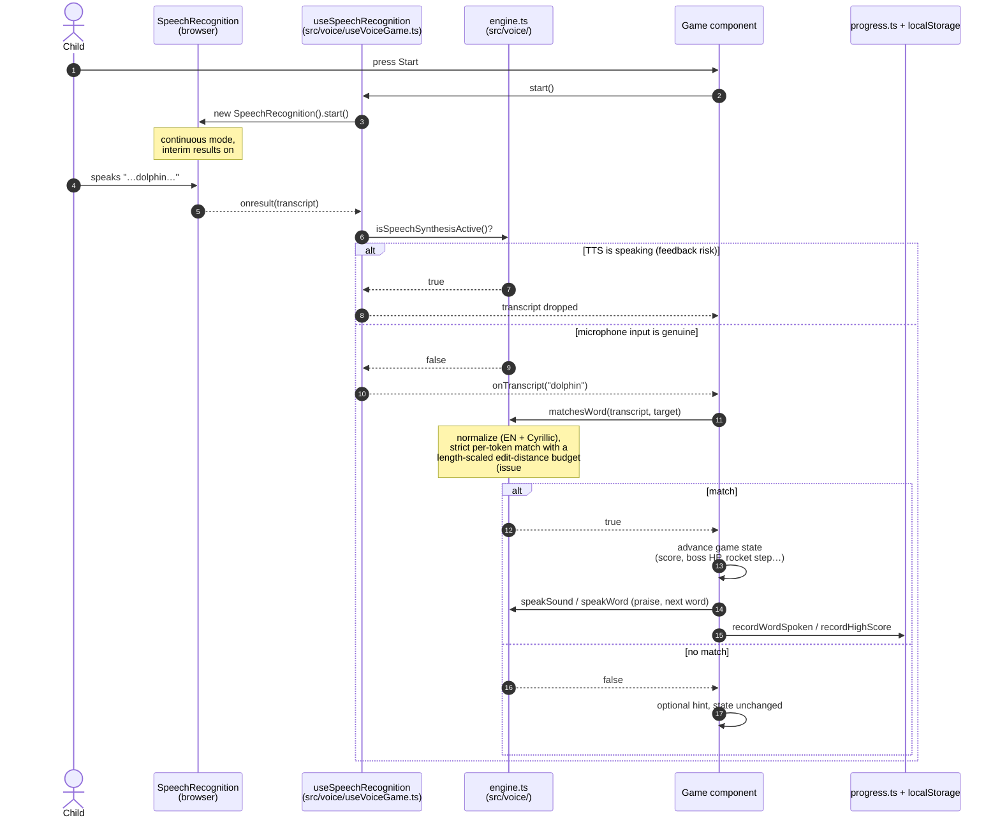
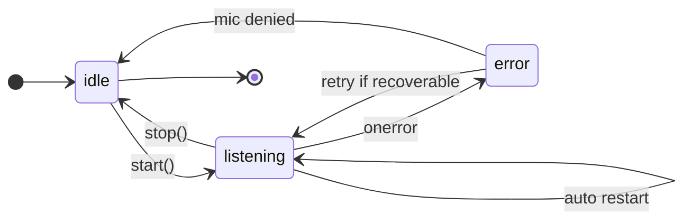

# Dynamic view - runtime behavior (Team 40)

The dynamic view shows what happens at runtime for the flow every game shares:
**a child speaks a word and the game reacts**. It also covers the two edge
cases that shaped the design: the anti-feedback gate and recognition restarts.

## Notation

The first diagram is a [Mermaid sequence diagram](https://mermaid.js.org/syntax/sequenceDiagram.html)
(UML-style: vertical lifelines are components, horizontal arrows are calls in
the direction of the caller, dashed arrows are returns). The second is a
[Mermaid state diagram](https://mermaid.js.org/syntax/stateDiagram.html)
(rounded boxes are recognizer states, arrows are transitions labeled with
their trigger). See also the notation notes in the
[static](../static-view/README.md#notation) and
[deployment](../deployment-view/README.md#notation) views (customer feedback, issue
#110).

## Main flow: one spoken word

## Anti-feedback gate (issue #81, ADR-004)

The app speaks words aloud (pronunciation playback, praise sounds). On laptops
without echo cancellation the microphone hears the app's own voice, the
recognizer transcribes it, and the game would score its own speech. The gate
closes this loop:

- `speakWord` records that speech synthesis is active until the utterance ends
  (plus a short tail margin).
- The recognition hook checks `isSpeechSynthesisActive()` on every result and
  drops transcripts that arrive while the app itself is speaking.

The gate lives in the shared voice module, so all six games are protected by
the same two functions.

## Recognition lifecycle and recovery

Chrome ends a continuous recognition session on silence (`onend`). The hook
keeps a `wantActive` flag: while the game wants the microphone on, every
`onend` triggers the **auto restart** transition, so a quiet child does not
silently lose voice control. `stop()` comes from the user or from game over.
`onerror` covers a denied microphone, no speech, and network failures; the
hook retries the recoverable ones and gives up only when the microphone is
denied. Errors are mapped to child-friendly status messages shown next to the
microphone indicator.

## Strict word matching (issue #97)

The original matcher accepted substrings and consonant skeletons, which let
almost any speech score ("bird" matched "bread"). Since v0.3.0 `matchesWord`
requires an exact token match after normalization, with a small edit-distance
tolerance that scales with word length (short words must match exactly), the
same first letter for fuzzy accepts, and a sliding window for multi-word
phrases. The no-false-accepts suite in `src/voice/voiceEngine.test.ts` locks
this behavior in.

## Deterministic racer movement (issue #85)

Voice Racer's lane changes go through a pure `updateRacerMovement` state
machine in `engine.ts`: recognized commands set a pending lane, and the update
function applies it on a fixed-timestep tick with a de-jitter interval, so
movement no longer depends on frame rate or on how often the recognizer emits
interim results. The function is pure and covered by unit tests.
