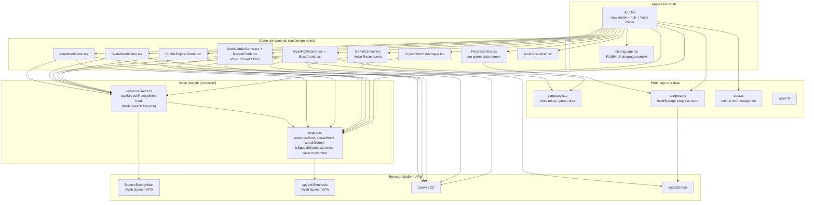

# Static view - components and dependencies (Team 40)

The static view shows how the codebase is decomposed into components and which
way the dependencies point. The guiding rule is that **dependencies point from
UI toward pure logic**: React components may import pure modules, pure modules
never import React or any component.

## Component diagram

## Component responsibilities

| Component | Responsibility | Tested by |
|---|---|---|
| `App.tsx` | Routes between the hub, the six games, and the Progress view; owns Voice Racer state; owns high scores and custom word lists | `src/App.test.tsx` |
| `src/voice/engine.ts` | Pure voice logic: word matching (Latin + Cyrillic, Levenshtein tolerance), text-to-speech with the anti-feedback gate, sound effects, deterministic racer movement update | `src/voice/voiceEngine.test.ts`, `src/utils.test.ts`, `src/utils.perf.test.ts` |
| `src/voice/useVoiceGame.ts` | React hook wrapping the `SpeechRecognition` lifecycle: start/stop, restart-on-end, error mapping to child-friendly status messages | game integration tests via `src/test/mockSpeechRecognition.ts` |
| `src/gameLogic.ts` | Pure game rules: Boss Fight roster (finite modes and Endless), win/lose conditions | `src/gameLogic.test.ts`, `src/gameLogic.gauntlet.test.ts` |
| `src/progress.ts` | Pure progress store: words practiced, high scores, sessions played; serialization to `localStorage` | `src/progress.test.ts` |
| `src/data.ts` | Built-in word categories (EN words, RU translations, emoji) | `src/data.test.ts` |
| Game components | Render one game each; consume the voice module for input/output and pure logic for rules | integration tests for Boss Fight and Rocket Climb |
| `uiLanguage.tsx` | UI language context (Russian-first with an RU/EN toggle) and translation lookup | exercised by component tests |

## Compatibility shims

`src/utils.ts` and `src/useSpeechRecognition.ts` are thin re-export shims kept
after the voice logic moved into `src/voice/` (issue #82), so older imports
keep compiling. New code must import from `src/voice/` directly; the shims can
be removed once no imports remain.

## Dependency rules

1. `src/voice/engine.ts`, `src/gameLogic.ts`, `src/progress.ts`, and
   `src/data.ts` are pure modules: no React imports, no component imports.
2. Game components never talk to `SpeechRecognition` or `speechSynthesis`
   directly; they go through the voice module. This is what makes the
   anti-feedback gate ([ADR-004](./adr/ADR-004-tts-anti-feedback-gate.md))
   apply everywhere at once.
3. Persistence is isolated: only `src/progress.ts`, the custom-words manager,
   and the high-score handlers in `App.tsx` touch `localStorage`.
