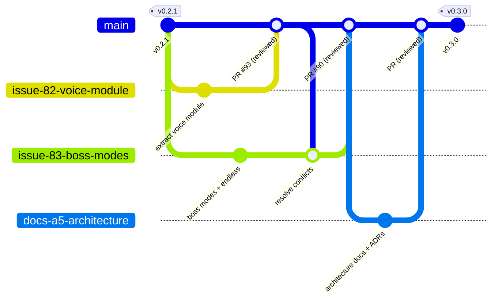

# Development process and configuration management (Team 40)

How Team 40 turns a backlog item into released software: the Scrum cadence,
the Git workflow, the quality gates, and how configuration (versions,
releases, environments) is managed. Introduced in Assignment 5 (Sprint 3) as a
maintained project asset.

## Scrum cadence

- **Sprints:** one week, aligned with course assignments
  (Sprint 1 = Assignment 3, Sprint 2 = Assignment 4, Sprint 3 = Assignment 5).
- **Roles:** Product Owner, Scrum Master, three developers; every member also
  implements and reviews.
- **Artifacts:** Product Backlog and Sprint Backlog on GitHub Project board
  #1 (Work Status + Sprint fields), user stories in
  [docs/user-stories.md](./user-stories.md), roadmap in
  [docs/roadmap.md](./roadmap.md).
- **Events:** sprint planning at week start (milestone + issue assignment),
  asynchronous daily coordination in the team chat, recorded customer Sprint
  Review / UAT session, team retrospective (published in `reports/weekN/`).
- **Sprint scope tracking:** each sprint is a GitHub milestone; every planned
  issue carries the milestone, story points, an implementer, and a reviewer
  (implementer != reviewer).

## Git workflow

The repository uses a **protected trunk** (`main`) with short-lived branches.

- `main` is protected: no direct pushes, no force-push, one required approving
  review, required CI checks, merge commits (no squash) so PR history stays
  intact.
- Every change starts from an issue. The branch is named after it:
  `issue/<number>-<short-slug>` (docs-only work may use `docs/<slug>`).
- One issue = one pull request; the PR body ends with `Closes #<n>` so the
  issue closes on merge and traceability is automatic.
- The assigned reviewer (a different team member) reviews in the GitHub UI,
  requests changes or approves, and merges. No self-merge.
- Merge conflicts are resolved by merging current `main` into the PR branch
  (history-preserving), never by force-pushing rewritten history.



## Quality gates (in order)

1. **Local:** `npm run lint` (tsc), `npm test`, `npm run build` clean before
   opening the PR; tests added or adjusted for the change.
2. **CI (GitHub Actions, `.github/workflows/ci.yml`):** type check, full test
   suite with per-file coverage thresholds, production build, Lighthouse
   accessibility check. `links.yml` checks documentation links.
3. **Human review:** one approving review from the assigned reviewer, checking
   the [Definition of Done](./definition-of-done.md).
4. **Post-merge:** user-facing changes recorded in `CHANGELOG.md`; docs
   (user stories, roadmap, quality docs, architecture) updated when affected.

## Configuration management

- **Versioning:** Semantic Versioning. MVP v1 = `v0.1.0`, Sprint 2 increments
  `v0.2.0`/`v0.2.1`, MVP v2 = `v0.3.0`. Tags are created on `main` after the
  sprint's PRs are merged, with a GitHub Release whose notes come from
  `CHANGELOG.md` ([Keep a Changelog](https://keepachangelog.com/en/1.1.0/)
  format).
- **Dependency configuration:** locked by `package-lock.json`; CI installs
  with `npm ci` so builds are reproducible.
- **Build configuration:** `vite.config.ts` (app), `vitest.config.ts` (tests +
  coverage thresholds), `tsconfig.json` (strict TypeScript). Production Pages
  builds add `--base=/voice-games/`.
- **Environments:** see the
  [deployment view](./architecture/deployment-view.md) - production on GitHub
  Pages (`gh-pages` branch), hosted docs under `/docs/` on the same branch,
  local dev server, and the frozen legacy VM.
- **Documentation as configuration:** the quality bar itself is versioned in
  the repo (`docs/definition-of-done.md`, `docs/quality-requirements.md`,
  `docs/testing.md`) and changes to it go through the same PR process.

## Documentation site

Project documentation is published as a static MkDocs (Material) site at
https://scaredofthesix.github.io/voice-games/docs/ - see `mkdocs.yml`.
Publishing:

```bash
pip install mkdocs-material
mkdocs build
npx gh-pages -d site --dest docs -b gh-pages --add
```

`--dest docs --add` places the site in the `docs/` subfolder of `gh-pages`
without touching the deployed application at the branch root.
