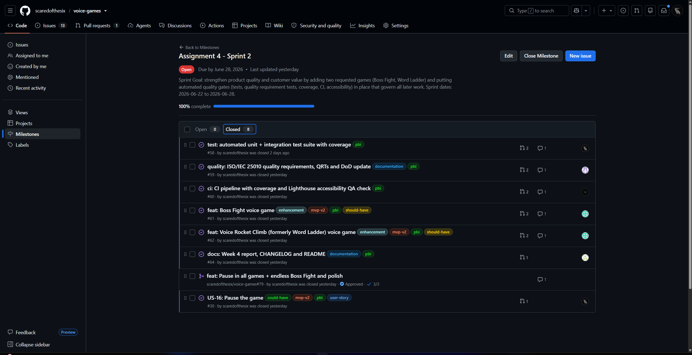
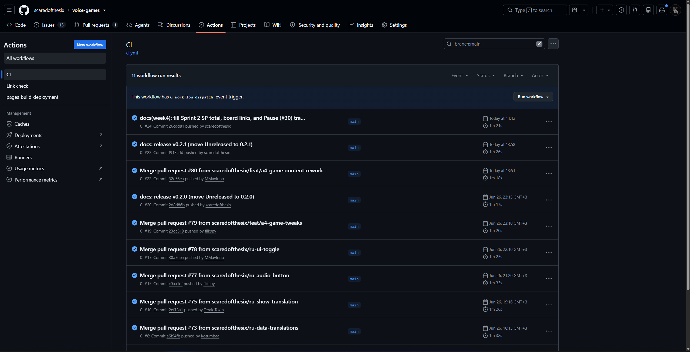
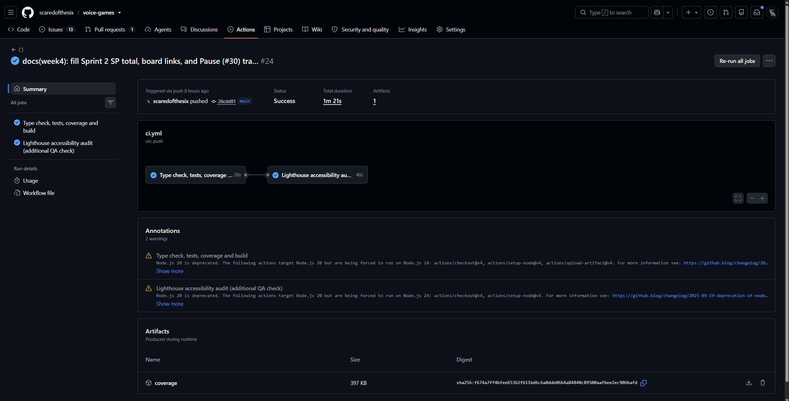
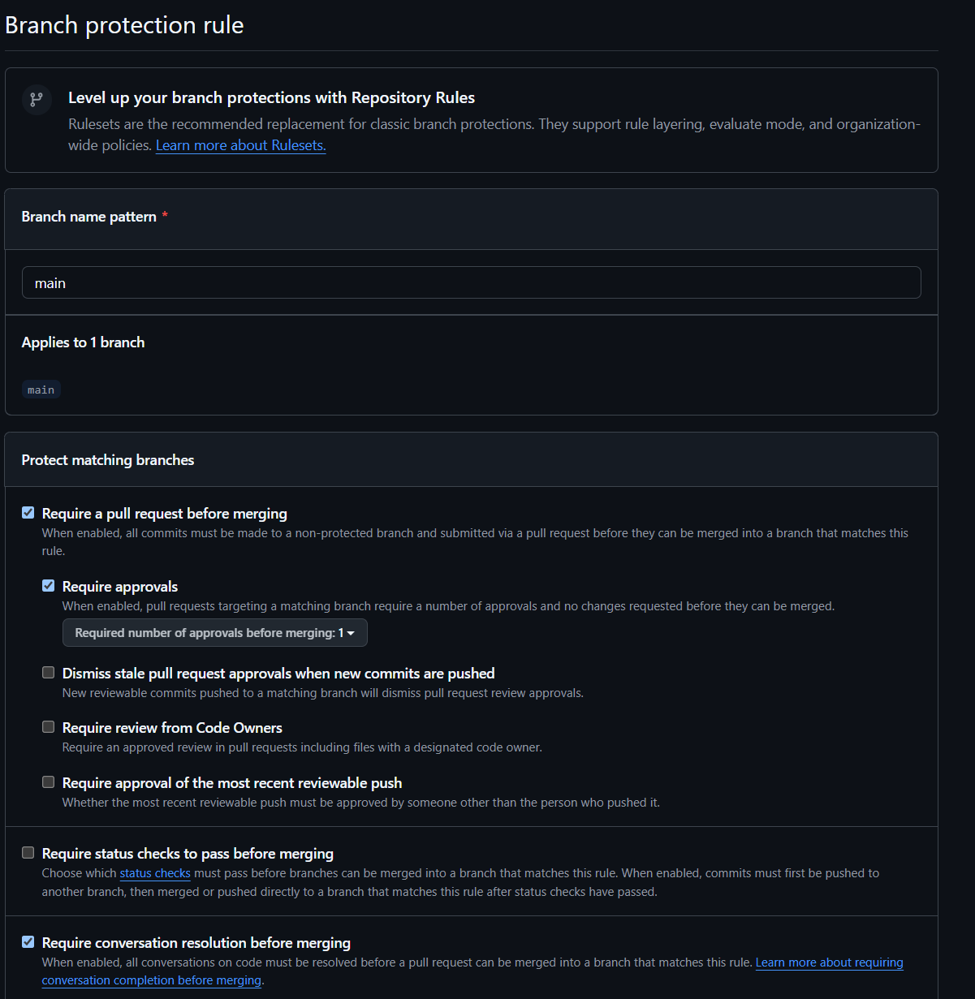
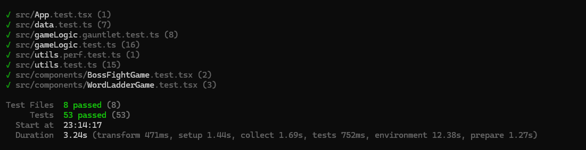
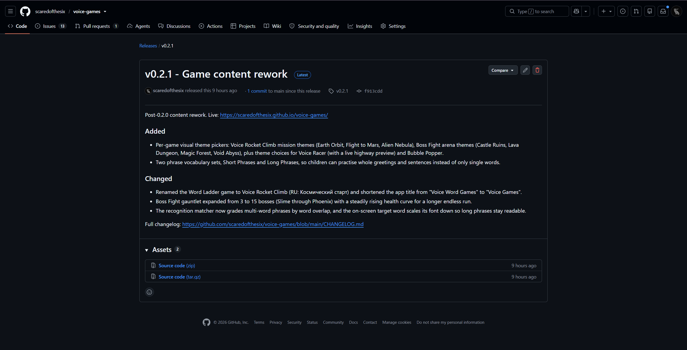
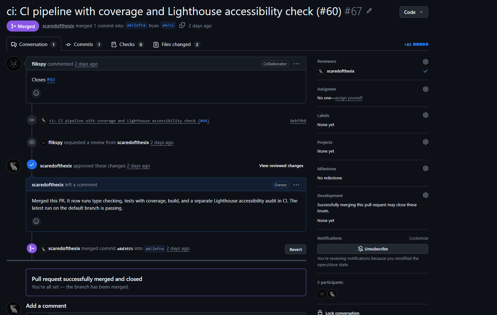

# Week 4 Report - Voice Games (Team 40)

Canonical public report and submission index for Assignment 4 (Sprint 2).
All public evidence is linked from here. Private identity, recordings, and
credentials live only in the Moodle PDF.

> All public Assignment 4 evidence is filled, linked, and embedded below. The
> only item outside the public repository is the private Moodle PDF (team
> identity, recording links and time-codes), as required by the assignment.

## Project

**Voice Games** is a browser-based set of voice-controlled English word games
for children (ages about 6 to 10). The child controls each game by pronouncing
the target English word out loud (Web Speech API, Chrome only).

- Repository: https://github.com/scaredofthesix/voice-games
- Deployed product (public, HTTPS): https://scaredofthesix.github.io/voice-games/
  (the GitHub Pages link may not open from some networks or regions without a VPN;
  this is an external GitHub availability restriction outside the team's control,
  and the same build can always be run locally from the repository)
- Run / access instructions: [root README](../../README.md)

## Sprint

- **Sprint Goal:** Strengthen product quality and raise customer value by adding
  two requested games and putting automated quality gates (tests, quality
  requirement tests, coverage, CI, and an accessibility check) in place that
  govern all later work.
- **Sprint dates:** 2026-06-22 to 2026-06-28.
- **Sprint milestone (authoritative scope):** [Assignment 4 - Sprint 2 milestone](https://github.com/scaredofthesix/voice-games/milestone/2).
- **Product Backlog board:** [GitHub Project - Product Backlog view](https://github.com/users/scaredofthesix/projects/1).
- **Sprint Backlog board/table:** [GitHub Project - Sprint Backlog view](https://github.com/users/scaredofthesix/projects/1) (filter Sprint = "Sprint 2"; the seven Assignment 4 milestone items).
- **Total Sprint size (Story Points):** 29 SP across 7 PBIs (Boss Fight 8, Voice Rocket Climb 5, test suite 5, quality reqs 3, CI 3, Pause 3, Week 4 report 2).

## Sprint scope and traceability

Every Sprint 2 backlog item, and the user story it serves, is mapped here to the
concrete evidence that represents it: the issue, the reviewed PR that delivered
it, the implementation file(s), the automated test, and the user-facing
acceptance or smoke scenario. This makes explicit how each selected scope item
(including the voice-recognition story US-08) is realized and verified in the
product.

| Backlog item (issue) | User story served | Reviewed PR | Implementation | Automated test | UAT / smoke |
|---|---|---|---|---|---|
| Boss Fight game ([#61](https://github.com/scaredofthesix/voice-games/issues/61)) | "More games" ([#54](https://github.com/scaredofthesix/voice-games/issues/54)); voice recognition US-08 | [#68](https://github.com/scaredofthesix/voice-games/pull/68) | `src/components/BossFightGame.tsx`, `src/gameLogic.ts` | `src/components/BossFightGame.test.tsx`, `src/gameLogic.test.ts` | UAT-02 + Boss Fight smoke |
| Voice Rocket Climb game, formerly Word Ladder ([#62](https://github.com/scaredofthesix/voice-games/issues/62)) | "More games" (#54); voice recognition US-08 | [#68](https://github.com/scaredofthesix/voice-games/pull/68) | `src/components/WordLadderGame.tsx`, `src/gameLogic.ts` | `src/components/WordLadderGame.test.tsx`, `src/gameLogic.test.ts` | UAT-03 + Voice Rocket Climb smoke |
| Pause the game ([#30](https://github.com/scaredofthesix/voice-games/issues/30), US-16) | customer review feedback | [#79](https://github.com/scaredofthesix/voice-games/pull/79) | Pause/resume control + microphone off in every game | manual smoke | n/a |
| Voice recognition accuracy = QR-1 functional correctness | US-08 robust recognition | [#65](https://github.com/scaredofthesix/voice-games/pull/65), [#68](https://github.com/scaredofthesix/voice-games/pull/68) | `src/utils.ts` (`matchesWord`), `src/useSpeechRecognition.ts` | `src/utils.test.ts` (QRT-1) | UAT-01..03 voice control |
| Start / response time = QR-2 performance efficiency | time behaviour | [#65](https://github.com/scaredofthesix/voice-games/pull/65) | recognition matcher path in `src/utils.ts` | `src/utils.perf.test.ts` (QRT-2) | smoke timing note |
| Accessibility / operability = QR-3 usability | usability for children | [#67](https://github.com/scaredofthesix/voice-games/pull/67) | ARIA roles in the game components | a11y assertions in integration tests + Lighthouse job (QRT-3) | UAT manual + Lighthouse |
| Automated test suite + coverage gates ([#58](https://github.com/scaredofthesix/voice-games/issues/58)) | quality foundation | [#65](https://github.com/scaredofthesix/voice-games/pull/65) | `vitest.config.ts`, `src/test/*` | full unit + integration suite | n/a |
| CI + accessibility QA ([#60](https://github.com/scaredofthesix/voice-games/issues/60)) | quality foundation | [#67](https://github.com/scaredofthesix/voice-games/pull/67) | `.github/workflows/ci.yml`, `lighthouserc.json` | CI on every PR and on `main` | n/a |
| Quality reqs + QRTs + DoD ([#59](https://github.com/scaredofthesix/voice-games/issues/59)) | quality foundation | [#69](https://github.com/scaredofthesix/voice-games/pull/69) | `docs/quality-requirements.md`, `docs/quality-requirement-tests.md`, `docs/definition-of-done.md` | QRT mapping | n/a |
| Week 4 report ([#64](https://github.com/scaredofthesix/voice-games/issues/64)) | process evidence | [#66](https://github.com/scaredofthesix/voice-games/pull/66) | `reports/week4/*` | n/a | n/a |

## Delivered product changes

- **Boss Fight** game: pronounce words to damage the boss; a per-word timer
  means a missed word costs the player a life. It is an endless gauntlet of 15
  bosses (Slime through Phoenix) with selectable arena themes.
- **Voice Rocket Climb** game (formerly Word Ladder): pronounce words to fly a
  rocket one step higher through selectable mission themes; reach orbit to win.
- Both games reuse the shared recognition matcher and a new shared speech hook,
  and are wired into the game hub.
- **Phrase practice:** two new vocabulary sets (Short Phrases, Long Phrases) let
  children practise whole greetings and sentences; the recognition matcher grades
  multi-word phrases by word overlap.
- Automated tests, quality requirements, quality requirement tests, CI quality
  gates, and an accessibility audit (see below).

## Customer feedback response

| Feedback point | Source | Resulting PBI or issue | Status | Response |
|---|---|---|---|---|
| The customer asked for more games (about four more for MVP v2). | Sprint 1 review | [#54](https://github.com/scaredofthesix/voice-games/issues/54), Boss Fight [#61](https://github.com/scaredofthesix/voice-games/issues/61), Voice Rocket Climb [#62](https://github.com/scaredofthesix/voice-games/issues/62) | Done (2 of the requested games) | Shipped Boss Fight and Voice Rocket Climb this sprint; the remaining games are queued for later sprints (two per week). |
| Add a Pause button that also stops the microphone. | earlier review | [#30](https://github.com/scaredofthesix/voice-games/issues/30) (US-16) | Done | Pause / Resume with a "Paused" overlay and microphone off, in every game. |
| The speech engine self-triggers from its own spoken hint (audio-loop false positive). | Sprint 2 UAT (2026-06-27) | [#81](https://github.com/scaredofthesix/voice-games/issues/81) | Planned (next release) | Will mute the microphone while text-to-speech plays and / or drop the auto hint, and recalibrate the tolerance lowered after v0.1.0. |
| Move core voice processing into a shared module reused by all games. | Sprint 2 UAT | [#82](https://github.com/scaredofthesix/voice-games/issues/82) | Planned (next release) | Single shared recognition module so the fix applies uniformly across all four games. |
| Replace Boss Fight's infinite loop with finite difficulty stages (10 / 20 / 30 words) plus an unlockable Infinite Mode; document the design. | Sprint 2 UAT | [#83](https://github.com/scaredofthesix/voice-games/issues/83) | Planned (next release) | Dual-layout Finite + Infinite mode; relates to difficulty levels (#27). |
| Default the interface to Russian on launch. | Sprint 2 UAT | [#84](https://github.com/scaredofthesix/voice-games/issues/84) | Planned (next release) | Launch in Russian for the target audience; keep the RU/EN toggle (US-17). |
| Voice Racer movement physics feel random while streaming. | Sprint 2 UAT | [#85](https://github.com/scaredofthesix/voice-games/issues/85) | Planned (next release) | Investigate frame pacing / movement smoothing under load. |
| Future polish: an interactive end-of-climb event (meet an alien) in Voice Rocket Climb. | Sprint 2 UAT | [#86](https://github.com/scaredofthesix/voice-games/issues/86) | Backlog (later) | Nice-to-have engagement boost at the climb finish. |

The customer accepted the increment. The demonstrated live build (**v0.2.1**) is
**not changed** in response to this review; every Sprint 2 UAT item above is
carried into the next release as backlog (issues #81 to #86), also recorded in
[docs/roadmap.md](../../docs/roadmap.md) and the `[Unreleased]` section of
[CHANGELOG.md](../../CHANGELOG.md).

The RU/EN bilingual interface toggle (US-17) was additionally delivered this
sprint. Feedback not addressed this sprint (for example parent progress US-10 and
difficulty levels US-12) remains on the roadmap.

## Quality model and documentation

- Quality model: ISO/IEC 25010 product quality. Selected sub-characteristics:
  **functional correctness**, **performance efficiency (time behaviour)**, and
  **usability (operability / accessibility)**.
- [docs/roadmap.md](../../docs/roadmap.md)
- [docs/definition-of-done.md](../../docs/definition-of-done.md)
- [docs/quality-requirements.md](../../docs/quality-requirements.md)
- [docs/quality-requirement-tests.md](../../docs/quality-requirement-tests.md)
- [docs/testing.md](../../docs/testing.md)
- [docs/user-acceptance-tests.md](../../docs/user-acceptance-tests.md)

## Testing status

All automated tests pass locally and in CI (53 tests at the time of writing).

| Critical module | Line coverage | Floor |
|-----------------|---------------|-------|
| `src/gameLogic.ts` | 100% | 30% |
| `src/utils.ts` | ~62% | 30% |
| `src/components/WordLadderGame.tsx` | ~92% | - |
| `src/components/BossFightGame.tsx` | ~91% | - |
| `src/data.ts` | 100% | - |

Global coverage is intentionally lower; rationale in
[docs/testing.md](../../docs/testing.md).

- Unit tests: [`src/utils.test.ts`](../../src/utils.test.ts),
  [`src/gameLogic.test.ts`](../../src/gameLogic.test.ts),
  [`src/data.test.ts`](../../src/data.test.ts).
- Integration tests:
  [`src/components/WordLadderGame.test.tsx`](../../src/components/WordLadderGame.test.tsx),
  [`src/components/BossFightGame.test.tsx`](../../src/components/BossFightGame.test.tsx).
- Automated quality requirement tests: QRT-1 (above), QRT-2
  [`src/utils.perf.test.ts`](../../src/utils.perf.test.ts), QRT-3 (accessibility
  assertions in the integration tests plus the Lighthouse job).

## CI and quality gates

- CI pipeline: [`.github/workflows/ci.yml`](../../.github/workflows/ci.yml)
  (type check, tests with coverage, build, Lighthouse accessibility audit).
- CI runs on `main`: [CI workflow filtered to `main`](https://github.com/scaredofthesix/voice-games/actions/workflows/ci.yml?query=branch%3Amain)
  (all recent runs green; e.g. [run 28288168347](https://github.com/scaredofthesix/voice-games/actions/runs/28288168347)).
  See [`images/ci-runs-main.png`](./images/ci-runs-main.png) and the run detail
  [`images/ci-run-detail.png`](./images/ci-run-detail.png).
- Branch protection: `main` requires a pull request, one approval, and
  conversation resolution before merging - see
  [`images/branch-protection-main.png`](./images/branch-protection-main.png).
- Additional QA check: Lighthouse accessibility audit (the `accessibility` job),
  green in the CI run - see the "Lighthouse accessibility audit" job in
  [`images/ci-run-detail.png`](./images/ci-run-detail.png).
- Link check (separate, not the additional QA check):
  [`.github/workflows/links.yml`](../../.github/workflows/links.yml).

These tests, CI checks, quality requirement tests, and the updated Definition of
Done are maintained assets and continue to govern later project work; later PBIs
must keep them passing or extend them rather than bypass them.

## Release

- SemVer releases for the Sprint 2 increment:
  [v0.2.0](https://github.com/scaredofthesix/voice-games/releases/tag/v0.2.0)
  and the current live patch
  [v0.2.1](https://github.com/scaredofthesix/voice-games/releases/tag/v0.2.1)
  (the build demonstrated at the review).
- [CHANGELOG.md](../../CHANGELOG.md)

## Demo and review evidence

- Public demo video (presentation, gameplay, and the increment demo): https://disk.yandex.ru/d/ug2Evs6iNoQ3eg
- Presentation slides: shared with instructors through the Moodle PDF (they carry
  team identity, kept out of the public repo).
- Public UAT results summary: customer executed UAT-01, UAT-02, UAT-03 on
  2026-06-27; all three passed. Details in
  [docs/user-acceptance-tests.md](../../docs/user-acceptance-tests.md) and
  [customer-review-summary.md](./customer-review-summary.md).
- [Customer review / UAT transcript (per-line timestamps)](./customer-review-transcript.md):
  published with the customer's permission (recording and transcript approved for
  the coursework); every line carries its own `[mm:ss]` timestamp.
- [Customer review summary](./customer-review-summary.md)
- [Reflection](./reflection.md)
- [Retrospective](./retrospective.md)
- [LLM usage report](./llm-report.md)

## Status and next steps

- **Current status:** Two new games shipped behind a full automated quality
  gate; recognition, game logic, and the new games are covered by tests and CI.
  Releases v0.2.0 and v0.2.1 are tagged on `main` (v0.2.1 is live), and the
  recorded Sprint Review + UAT was completed on 2026-06-27 with the increment
  accepted.
- **Next steps:** Address the next-release backlog from the review (issues #81 to
  #86 - audio-loop fix, shared voice module, Boss Fight finite modes, RU default,
  Racer physics) and keep continuing MVP v2 (parent progress, more games) on top
  of the now-enforced quality gates.

## Contribution traceability

GitHub handles are used here (identity-safe for the public repo); the
handle-to-name mapping is in the Moodle PDF. Each member authored at least one
issue-linked PR and reviewed a different member's PR (no self-review). The "Main
contribution" column states the work each member led this sprint; the PR columns
show the GitHub authorship and review evidence.

| Member (GitHub) | Main contribution (Sprint 2) | PRs authored | PRs reviewed |
|---|---|---|---|
| @scaredofthesix | Built both new games end to end (Boss Fight gauntlet and Voice Rocket Climb): game logic, canvas visuals, the per-game setup screens, and the shared speech-recognition hook. Stood up the Vitest test foundation (unit, integration, and performance tests). Wrote the Week 4 report, the customer review transcript and summary, the UAT scenarios, the quality-doc sync, and the CHANGELOG and README. Ran the GitHub process: Sprint 2 milestone, issues, Project board, the v0.2.0 / v0.2.1 releases, and the GitHub Pages deployment. | [#65](https://github.com/scaredofthesix/voice-games/pull/65) (test infrastructure), [#79](https://github.com/scaredofthesix/voice-games/pull/79) (Pause in all games), [#80](https://github.com/scaredofthesix/voice-games/pull/80) (game content rework) | [#67](https://github.com/scaredofthesix/voice-games/pull/67) (CI) |
| @Kotumbaa | Prepared the sanitized customer review transcript and built the presentation slide deck. Implemented the Russian word-set data (translations for the built-in vocabulary) so the bilingual mode has content, and owned the two-game integration PR. Reviewed the test-infrastructure PR. | [#68](https://github.com/scaredofthesix/voice-games/pull/68) (two new games), [#73](https://github.com/scaredofthesix/voice-games/pull/73) (RU word-set data) | [#65](https://github.com/scaredofthesix/voice-games/pull/65) (test infrastructure) |
| @TeraloToxin | Produced the presentation video for the sprint review. Authored the Week 4 report PR and implemented showing the Russian translation of the target word during play (part of the bilingual support). Reviewed the two-game PR. | [#66](https://github.com/scaredofthesix/voice-games/pull/66) (Week 4 report), [#75](https://github.com/scaredofthesix/voice-games/pull/75) (show RU translation) | [#68](https://github.com/scaredofthesix/voice-games/pull/68) (two new games) |
| @MMavInno | Recorded the gameplay demo video. As Product Owner, maintained the Product Backlog, prioritization, and accepted the increment at the review. Authored the quality requirements, the automated quality requirement tests, and the Definition of Done update, plus the RU/EN interface toggle. Reviewed the Week 4 report PR. | [#69](https://github.com/scaredofthesix/voice-games/pull/69) (quality requirements + QRTs + DoD), [#78](https://github.com/scaredofthesix/voice-games/pull/78) (RU/EN interface toggle) | [#66](https://github.com/scaredofthesix/voice-games/pull/66) (Week 4 report) |
| @flikspy | Built the continuous integration pipeline (type check, tests with coverage, build, and the Lighthouse accessibility audit as the additional QA check) and the branch-protection workflow it enforces. Added the "Listen in Russian" audio button and gameplay tweaks (endless Boss Fight, pause polish). Reviewed the quality-requirements PR. | [#67](https://github.com/scaredofthesix/voice-games/pull/67) (CI + accessibility), [#77](https://github.com/scaredofthesix/voice-games/pull/77) (RU audio button) | [#69](https://github.com/scaredofthesix/voice-games/pull/69) (quality requirements) |

## Embedded screenshots (reports/week4/images/)

**Assignment 4 - Sprint 2 milestone (100% complete, 8 items closed):**

**CI runs on `main` (all green):**

**CI run detail - type check, tests with coverage, build, and the Lighthouse accessibility audit (additional QA check) all passing, with the coverage artifact:**

**Branch protection for `main` (pull request required, one approval, conversation resolution):**

**Automated test suite (53 tests passing):**

**SemVer release v0.2.1 (Latest):**

**An example reviewed, issue-linked PR (#67: authored by one member, approved and merged by a different member):**

## Submission integrity checklist (avoid repeat deductions)

Lessons carried over from earlier assignment feedback. Confirm each before the
Moodle upload:

- [x] Scope traceability: the "Sprint scope and traceability" table above maps
  every scope item and its user story (including US-08) to issue, PR, code, and
  test.
- [x] Voice-triggered outcome: the smoke evidence shows at least one full
  spoken-word-to-win outcome per new game, not just app open plus microphone on
  (see `docs/testing.md`).
- [x] Transcript timestamps: `customer-review-transcript.md` has a per-line
  `[mm:ss]` timestamp on every line.
- [x] Fresh link check: the Link check workflow
  ([`links.yml`](../../.github/workflows/links.yml)) runs automatically on every
  push to `main`, so the run on the final merged commit is the authoritative one;
  it can also be re-run on demand (`workflow_dispatch`).
- [x] PR evidence: the
  [pull request template](../../.github/PULL_REQUEST_TEMPLATE.md) includes a
  "Testing performed" section, which the Sprint 2 PRs fill in.

---

All public Assignment 4 evidence is complete and linked above:

1. Assignment 4 - Sprint 2 milestone, Sprint Backlog Project view, and the
   issue-linked PRs (implementer and a different reviewer each) are in place.
2. CI on `main` is green (including the Lighthouse accessibility job); v0.2.0 and
   v0.2.1 are tagged, v0.2.1 is live.
3. Recorded Sprint Review + UAT held on 2026-06-27 (3 scenarios), increment
   accepted; transcript, summary, and UAT execution history filled. Resulting
   feedback captured as next-release backlog (issues #81 to #86).
4. Demo video linked; evidence screenshots embedded in `reports/week4/images/`.

The only step left is outside the public repository: assemble the **Moodle PDF**
(team identity, recording links and time-codes, presentation slides), which is
private by assignment rules.
