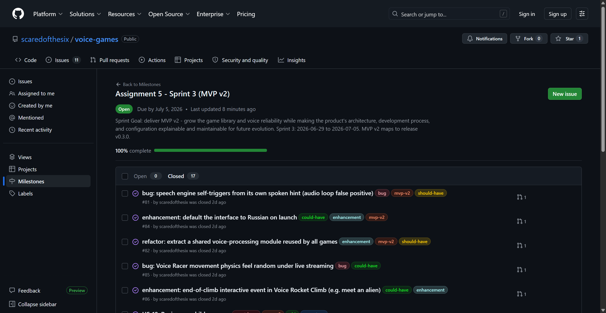
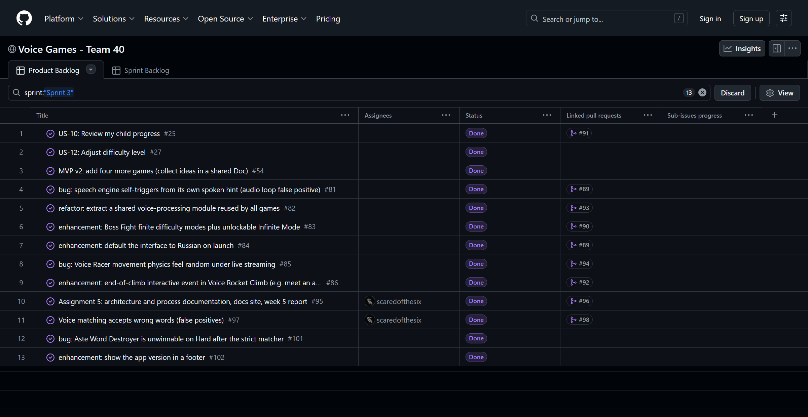
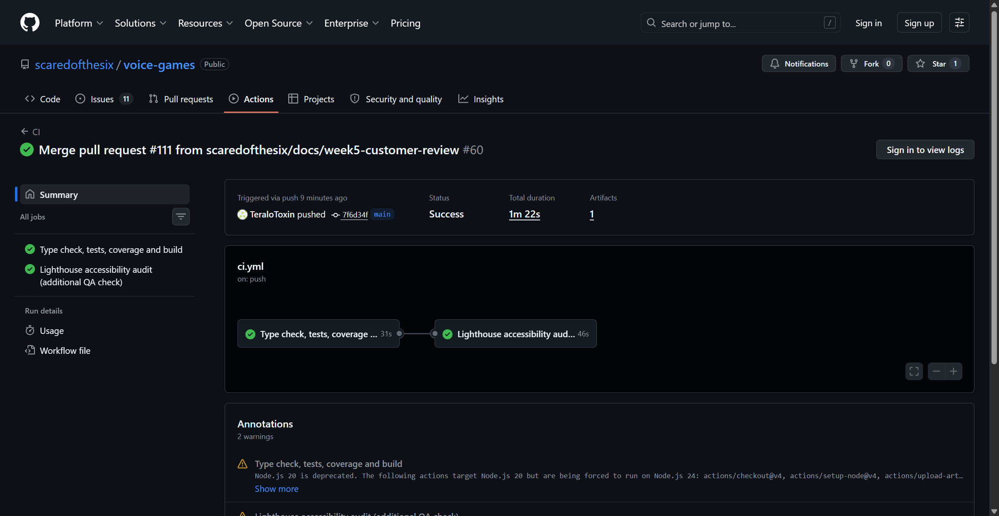
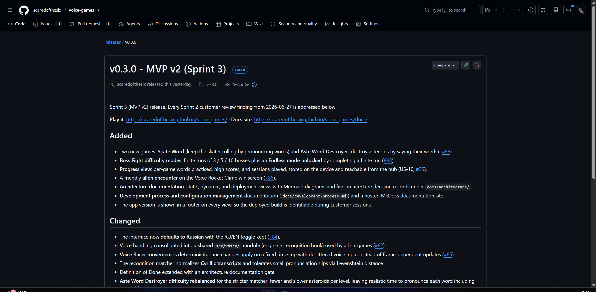
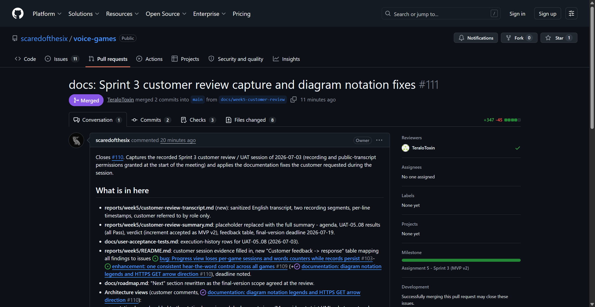
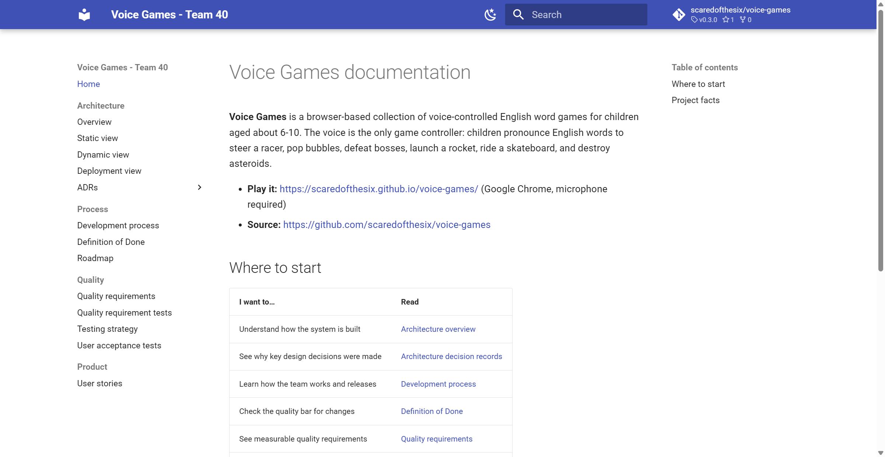
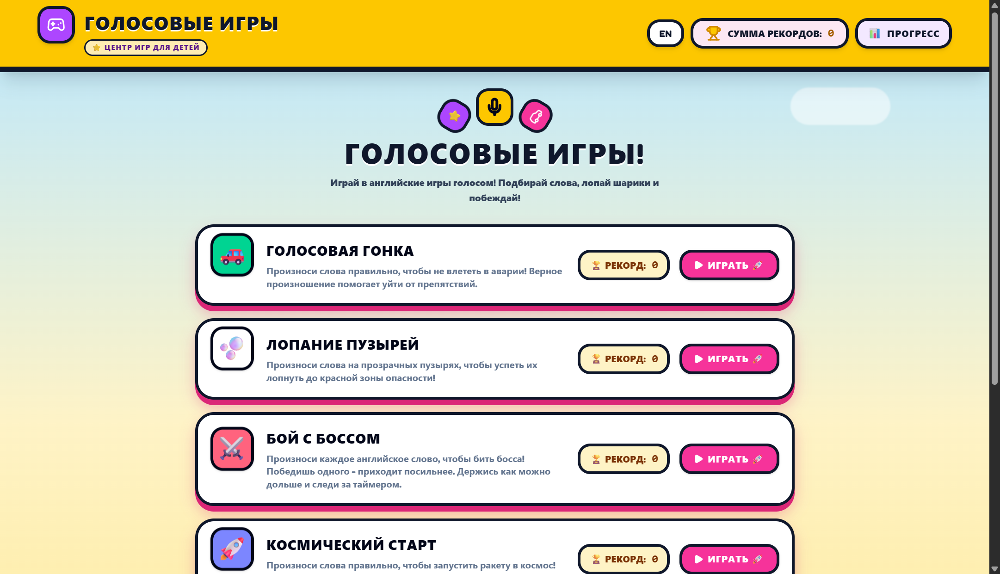

# Week 5 Report - Voice Games (Team 40)

Canonical public report and submission index for Assignment 5 (Sprint 3,
MVP v2). All public evidence is linked from here. Private identity,
recordings, and credentials live only in the Moodle PDF.

> Status: sprint closed. All evidence collected; the increment was accepted
> by the customer as MVP v2 and released as v0.3.0.

## Project

**Voice Games** is a browser-based set of voice-controlled English word games
for children (ages about 6 to 10). The child controls each game by pronouncing
the target English word out loud (Web Speech API, Chrome only).

- Repository: https://github.com/scaredofthesix/voice-games
- Deployed product (public, HTTPS): https://scaredofthesix.github.io/voice-games/
  (the GitHub Pages link may not open from some networks or regions without a
  VPN; this is an external GitHub availability restriction outside the team's
  control, and the same build can always be run locally from the repository)
- Hosted documentation site (MkDocs): https://scaredofthesix.github.io/voice-games/docs/
- Run / access instructions: [root README](../../README.md)

## Sprint

- **Sprint Goal:** Deliver MVP v2 - grow the game library and voice
  reliability while making the product's architecture, development process,
  and configuration explainable and maintainable for future evolution.
- **Sprint dates:** 2026-06-29 to 2026-07-05.
- **Sprint milestone (authoritative scope):** [Assignment 5 - Sprint 3 (MVP v2)](https://github.com/scaredofthesix/voice-games/milestone/3).
- **Product Backlog board:** [GitHub Project - Product Backlog view](https://github.com/users/scaredofthesix/projects/1).
- **Sprint Backlog board/table:** [GitHub Project - Sprint Backlog view](https://github.com/users/scaredofthesix/projects/1) (filter Sprint = "Sprint 3").
- **Total Sprint size (Story Points):** 45 SP planned across 8 PBIs, plus 5 SP
  of emergent work accepted mid-sprint (#97, #101, #102) = 50 SP delivered.
- **Release:** MVP v2 = [v0.3.0](https://github.com/scaredofthesix/voice-games/releases/tag/v0.3.0) (tagged 2026-07-03, marked Latest). MVP v1 = v0.1.0; v0.2.x were Sprint 2 increments toward MVP v2.

## Sprint scope and traceability

Every Sprint 3 backlog item is mapped to the issue, the reviewed PR that
delivered it, the implementer and reviewer (always different members), the
implementation, and the verification.

| Backlog item (issue) | SP | Reviewed PR | Implementer -> Reviewer | Implementation | Verification |
|---|---|---|---|---|---|
| Two new games: Skate Word + Aste Word Destroyer | 8 | [#88](https://github.com/scaredofthesix/voice-games/pull/88) | TeraloToxin -> scaredofthesix | `src/components/SkateWordGame.tsx`, `src/components/AsteWordGame.tsx` | UAT-05; manual smoke |
| Voice anti-feedback guard ([#81](https://github.com/scaredofthesix/voice-games/issues/81)) + Russian-first UI ([#84](https://github.com/scaredofthesix/voice-games/issues/84)) | 5 | [#89](https://github.com/scaredofthesix/voice-games/pull/89) | scaredofthesix -> Kotumbaa | `src/voice/engine.ts` gate, `src/uiLanguage.tsx`, matcher RU/EN | UAT-08; unit tests; [ADR-004](../../docs/architecture/adr/ADR-004-tts-anti-feedback-gate.md) |
| Shared voice-processing module ([#82](https://github.com/scaredofthesix/voice-games/issues/82)) | 5 | [#93](https://github.com/scaredofthesix/voice-games/pull/93) | flikspy -> TeraloToxin | `src/voice/engine.ts`, `src/voice/useVoiceGame.ts` | `src/voice/voiceEngine.test.ts`; [ADR-005](../../docs/architecture/adr/ADR-005-shared-voice-module.md) |
| Boss Fight finite modes + unlockable Endless ([#83](https://github.com/scaredofthesix/voice-games/issues/83)) | 5 | [#90](https://github.com/scaredofthesix/voice-games/pull/90) | Kotumbaa -> flikspy | `src/gameLogic.ts`, `src/components/BossFightGame.tsx` | UAT-06; `src/gameLogic.gauntlet.test.ts` |
| Deterministic Voice Racer movement ([#85](https://github.com/scaredofthesix/voice-games/issues/85)) | 3 | [#94](https://github.com/scaredofthesix/voice-games/pull/94) | flikspy -> MMavInno | `updateRacerMovement` in `src/voice/engine.ts` | unit tests on the movement update |
| End-of-climb alien encounter ([#86](https://github.com/scaredofthesix/voice-games/issues/86)) | 3 | [#92](https://github.com/scaredofthesix/voice-games/pull/92) | MMavInno -> flikspy | `src/components/RocketClimb.tsx`, Rocket Climb win screen | win-screen integration test |
| Progress view, US-10 ([#25](https://github.com/scaredofthesix/voice-games/issues/25)) | 8 | [#91](https://github.com/scaredofthesix/voice-games/pull/91) | Kotumbaa -> MMavInno | `src/progress.ts`, `src/components/ProgressView.tsx` | UAT-07; progress unit + integration tests |
| Architecture, process docs, docs site, reports ([#95](https://github.com/scaredofthesix/voice-games/issues/95)) | 8 | [#96](https://github.com/scaredofthesix/voice-games/pull/96), [#100](https://github.com/scaredofthesix/voice-games/pull/100) | scaredofthesix -> Kotumbaa | `docs/architecture/*`, `docs/development-process.md`, `mkdocs.yml`, `reports/week5/*` | link check CI; docs site build |
| Strict voice matching, no false accepts ([#97](https://github.com/scaredofthesix/voice-games/issues/97)) - emergent, from user testing | 3 | [#98](https://github.com/scaredofthesix/voice-games/pull/98), [#99](https://github.com/scaredofthesix/voice-games/pull/99) | scaredofthesix -> TeraloToxin | `matchesWord` in `src/voice/engine.ts` | no-false-accepts unit suite; local playtest |
| Aste difficulty rebalance ([#101](https://github.com/scaredofthesix/voice-games/issues/101)) + version footer ([#102](https://github.com/scaredofthesix/voice-games/issues/102)) - emergent, follow-up to #97 | 2 | [#99](https://github.com/scaredofthesix/voice-games/pull/99) | scaredofthesix -> TeraloToxin | `src/components/AsteWordGame.tsx` levels; `__APP_VERSION__` footer in `src/App.tsx` | playtest of all levels; footer visible on the live build |

## Delivered product changes (MVP v2 over v0.2.1)

- **Two new games:** Skate Word and Aste Word Destroyer - six voice games total.
- **Voice reliability:** the app no longer scores its own spoken hints
  (anti-feedback gate), the matcher handles Russian transcripts and small
  pronunciation slips (Cyrillic normalization + Levenshtein tolerance), and
  false accepts were eliminated with strict per-token matching (#97).
- **Russian-first UI** with an RU/EN toggle.
- **Boss Fight modes:** finite runs (3/5/10 bosses) plus an unlockable Endless mode
  (direct Sprint 2 customer request).
- **Deterministic Voice Racer movement** under live speech streaming.
- **Rocket Climb alien encounter** on the win screen.
- **Progress view:** per-game words practised, high scores, and sessions,
  persisted on the device.

## Architecture and process documentation (new in Assignment 5)

**Architecture in one paragraph:** Voice Games is a client-only single-page
application: React renders the UI, the Web Speech API turns the child's voice
into text and reads words aloud, a pure matching engine decides whether the
spoken text matches the target word, and each game renders on a canvas or DOM
scene. There is no backend and no account system; persistence is
`localStorage` only, and the production build is a static bundle on GitHub
Pages over HTTPS. This structure is what lets five students ship a
customer-testable increment every sprint: no servers to operate, no secrets to
manage, and one shared voice module through which every reliability fix
reaches all six games at once.

**Quality requirements and architecture decisions are linked both ways:**
each ADR names the quality requirement(s) it addresses, and each quality
requirement in [docs/quality-requirements.md](../../docs/quality-requirements.md)
lists its related ADRs (for example, QR-1 "no false accepts" is addressed by
the anti-feedback gate ADR-004 and the shared strict matcher ADR-005, while
QR-3 accessibility exists as a maintained commitment because canvas rendering
ADR-002 makes the DOM chrome the only accessible surface).

- [Architecture overview](../../docs/architecture/README.md) with
  [static](../../docs/architecture/static-view/README.md),
  [dynamic](../../docs/architecture/dynamic-view/README.md), and
  [deployment](../../docs/architecture/deployment-view/README.md) views
  (Mermaid, diagrams-as-code stored in per-view directories).
- [Five ADRs](../../docs/architecture/adr/README.md) recording the significant
  decisions (client-only Web Speech, canvas rendering, GitHub Pages, the
  anti-feedback gate, the shared voice module).
- [Development process and configuration management](../../docs/development-process.md)
  (Scrum cadence, protected-trunk Git workflow with a gitGraph, quality gates,
  SemVer releases).
- Hosted docs site: https://scaredofthesix.github.io/voice-games/docs/
  (MkDocs Material, `mkdocs.yml`; published 2026-07-03).
- Definition of Done extended with the architecture documentation gate
  ([docs/definition-of-done.md](../../docs/definition-of-done.md), item 12).
- Four new UAT scenarios UAT-05..08
  ([docs/user-acceptance-tests.md](../../docs/user-acceptance-tests.md)).

## Maintained project documentation

- [docs/roadmap.md](../../docs/roadmap.md) - product direction, current
  sprint, MVP v2, and the next expected increment.
- [docs/definition-of-done.md](../../docs/definition-of-done.md)
- [docs/testing.md](../../docs/testing.md)
- [docs/quality-requirements.md](../../docs/quality-requirements.md)
- [docs/quality-requirement-tests.md](../../docs/quality-requirement-tests.md)
- [docs/user-acceptance-tests.md](../../docs/user-acceptance-tests.md)
- [docs/development-process.md](../../docs/development-process.md)
- [docs/architecture/README.md](../../docs/architecture/README.md) and
  [ADR index](../../docs/architecture/adr/README.md)
- [docs/user-stories.md](../../docs/user-stories.md)
- [CHANGELOG.md](../../CHANGELOG.md)

## Testing and CI status for the delivered increment

- All Assignment 4 gates stayed active the whole sprint: type check, the
  Vitest suite with coverage thresholds, production build, link check, and the
  Lighthouse accessibility audit.
- The suite grew with the increment: 80 tests at v0.3.0, including the new
  no-false-accepts matcher suite, voice-engine unit tests, Boss mode tests,
  and Progress view unit + integration tests. Coverage thresholds include a
  per-file gate on `src/voice/engine.ts`.
- CI pipeline definition: [.github/workflows/ci.yml](../../.github/workflows/ci.yml)
  ([all runs](https://github.com/scaredofthesix/voice-games/actions/workflows/ci.yml)).
- Latest protected-default-branch CI run (green):
  https://github.com/scaredofthesix/voice-games/actions/runs/28700955299

## UAT results (executed with the customer on live v0.3.0, 2026-07-03)

| UAT | Scenario | Result |
|---|---|---|
| UAT-05 | Skate Word and Aste Word Destroyer are playable by voice | Pass |
| UAT-06 | Boss Fight finite modes and unlockable Endless | Pass |
| UAT-07 | Progress view records and shows practised words and scores | Pass |
| UAT-08 | Russian-first UI and no self-scoring of app speech | Pass |

No executed scenario failed. Product improvements the customer still wants
are tracked as issues #103-#109 in the feedback table below; execution
evidence rows live in
[docs/user-acceptance-tests.md](../../docs/user-acceptance-tests.md).

## Scrum events and evidence

- Sprint planning: milestone #3 scoped 2026-06-29 with implementer/reviewer
  assignment per PBI (see the table above).
- Customer Sprint Review + UAT session: held 2026-07-03 (recorded, permissions
  granted; customer executed UAT-05..08 on the live v0.3.0 build - all passed).
  Summary: [sprint-review-summary.md](./sprint-review-summary.md),
  sanitized transcript:
  [sprint-review-transcript.md](./sprint-review-transcript.md); private
  links and timecodes in the Moodle PDF.
- Retrospective: [retrospective.md](./retrospective.md).
- Customer verdict: increment accepted as MVP v2; all feedback targets the
  final version, which the customer expects **by 2026-07-19** (end of the week
  preceding the demo day).
- Reflection: [reflection.md](./reflection.md).
- LLM usage report: [llm-report.md](./llm-report.md).
- Public demo video of the MVP v2 increment (gameplay of the released
  v0.3.0 build): https://disk.yandex.ru/i/STwQZSAFWQPaGg

## Customer feedback -> response (Sprint 3 review, 2026-07-03)

| # | Customer feedback | Response |
|---|---|---|
| 1 | Progress view lost per-game sessions/words counters while records persisted (bug found live) | [#103](https://github.com/scaredofthesix/voice-games/issues/103) - fix in the next sprint |
| 2 | Progress CSV export needs readable columns | [#104](https://github.com/scaredofthesix/voice-games/issues/104) - next sprint |
| 3 | Use progress statistics to select the next word in the games (repeat struggled words, add unseen ones, de-prioritize mastered ones) | [#105](https://github.com/scaredofthesix/voice-games/issues/105) - committed for the final version |
| 4 | Skate Word skater floats above the road; jump should clear obstacles | [#106](https://github.com/scaredofthesix/voice-games/issues/106) - next sprint |
| 5 | Aste Word Destroyer should show Russian translations | [#107](https://github.com/scaredofthesix/voice-games/issues/107) - next sprint |
| 6 | Boss Fight hit counter too small and ambiguous; duplicated health bar questioned | [#108](https://github.com/scaredofthesix/voice-games/issues/108) - next sprint |
| 7 | Rename "Help" to "EN"/flag; one consistent hear-the-word control in all games | [#109](https://github.com/scaredofthesix/voice-games/issues/109) - committed for the final version |
| 8 | Architecture diagrams need a notation legend; deployment HTTPS GET arrow direction was wrong | [#110](https://github.com/scaredofthesix/voice-games/issues/110) - fixed in this docs update |

Agreed deadline: final version ready by **2026-07-19** (four more games plus
the fixes above).

Feedback points 1-7 are intentionally not fixed inside Sprint 3: they were
raised at the Sprint 3 review itself (2026-07-03, two days before the sprint
end), so the team triaged each into a linked backlog issue and scheduled them
for the final-version sprint instead of rushing unreviewed changes into the
released increment. Point 8 (documentation) was safe to fix immediately and
was delivered in PR #111.

## Contribution traceability (Sprint 3)

| Member | Implemented (issue-linked PRs) | Reviewed | Other work |
|---|---|---|---|
| @scaredofthesix (Scrum Master) | [#89](https://github.com/scaredofthesix/voice-games/pull/89) anti-feedback gate #81 + Russian-first UI #84; [#98](https://github.com/scaredofthesix/voice-games/pull/98)/[#99](https://github.com/scaredofthesix/voice-games/pull/99) strict matcher #97, Aste rebalance #101, version footer #102; docs PRs [#96](https://github.com/scaredofthesix/voice-games/pull/96), [#100](https://github.com/scaredofthesix/voice-games/pull/100), [#111](https://github.com/scaredofthesix/voice-games/pull/111), [#112](https://github.com/scaredofthesix/voice-games/pull/112) | [#88](https://github.com/scaredofthesix/voice-games/pull/88) | Architecture docs + 5 ADRs, development-process doc, MkDocs site, v0.3.0 release and deployment, week5 report |
| @flikspy (Developer) | [#93](https://github.com/scaredofthesix/voice-games/pull/93) shared voice module #82; [#94](https://github.com/scaredofthesix/voice-games/pull/94) deterministic Racer movement #85 | [#90](https://github.com/scaredofthesix/voice-games/pull/90), [#92](https://github.com/scaredofthesix/voice-games/pull/92) | Voice-engine unit tests |
| @Kotumbaa (Developer) | [#90](https://github.com/scaredofthesix/voice-games/pull/90) Boss Fight modes #83; [#91](https://github.com/scaredofthesix/voice-games/pull/91) Progress view #25 | [#89](https://github.com/scaredofthesix/voice-games/pull/89), [#96](https://github.com/scaredofthesix/voice-games/pull/96), [#100](https://github.com/scaredofthesix/voice-games/pull/100) | Boss roster + Progress unit/integration tests |
| @MMavInno (Product Owner) | [#92](https://github.com/scaredofthesix/voice-games/pull/92) Rocket Climb alien encounter #86 | [#94](https://github.com/scaredofthesix/voice-games/pull/94), [#91](https://github.com/scaredofthesix/voice-games/pull/91) | Backlog refinement and prioritization for Sprint 3 and the final version |
| @TeraloToxin (Developer) | [#88](https://github.com/scaredofthesix/voice-games/pull/88) two new games (Skate Word, Aste Word Destroyer) | [#93](https://github.com/scaredofthesix/voice-games/pull/93), [#98](https://github.com/scaredofthesix/voice-games/pull/98), [#99](https://github.com/scaredofthesix/voice-games/pull/99), [#111](https://github.com/scaredofthesix/voice-games/pull/111), [#112](https://github.com/scaredofthesix/voice-games/pull/112) | Facilitated the customer Sprint Review + UAT session |

Every member authored at least one issue-linked, reviewed PR and reviewed at
least one other member's PR; implementer and reviewer always differ.

## Product status and next steps

**Status:** MVP v2 is released as v0.3.0 (Latest) and publicly deployed. Six
voice-controlled games, Russian-first UI with an RU/EN toggle, a strict
no-false-accepts matcher, an anti-feedback gate, a device-local Progress view,
architecture + process documentation with a hosted docs site, and a green CI
gate on the protected default branch. The customer accepted the increment at
the Sprint 3 review.

**Next steps (final version, expected by 2026-07-19):** four more games and
the review follow-ups [#103](https://github.com/scaredofthesix/voice-games/issues/103)-[#109](https://github.com/scaredofthesix/voice-games/issues/109),
with adaptive word selection from progress statistics (#105) and the
consistent hear-the-word control (#109) as the customer's priorities. Later
maintainability work is listed in [docs/roadmap.md](../../docs/roadmap.md).

## Evidence checklist (screenshots in ./images/)

- [x] Milestone #3 with all issues closed - [milestone-3-closed.png](./images/milestone-3-closed.png)
- [x] Sprint 3 board view (Work Status = Done) - [sprint3-board-done.png](./images/sprint3-board-done.png)
- [x] Green CI run on main after the last merge - [ci-main-green.png](./images/ci-main-green.png)
- [x] v0.3.0 release page - [release-v0.3.0.png](./images/release-v0.3.0.png)
- [x] A reviewed PR showing approval by the assigned reviewer - [pr-111-approved.png](./images/pr-111-approved.png)
- [x] Docs site home page - [docs-site-home.png](./images/docs-site-home.png)
- [x] Deployed product view - [app-hub-v0.3.0.png](./images/app-hub-v0.3.0.png)
- [x] Public demo video - https://disk.yandex.ru/i/STwQZSAFWQPaGg

## Embedded screenshots (reports/week5/images/)

Milestone #3 at 100 percent with 0 open / 17 closed issues:

Project board filtered to Sprint 3: 13 items, all Done, with linked PRs:

Green CI run on main after the PR #111 merge (type check, tests, coverage,
build, Lighthouse accessibility audit):

Release v0.3.0 marked Latest:

Reviewed PR #111, merged with the assigned reviewer's approval:

Hosted documentation site home page:

Deployed product (game hub, Russian-first UI, v0.3.0 footer) - included
because the public GitHub Pages link may need a VPN in some regions:

