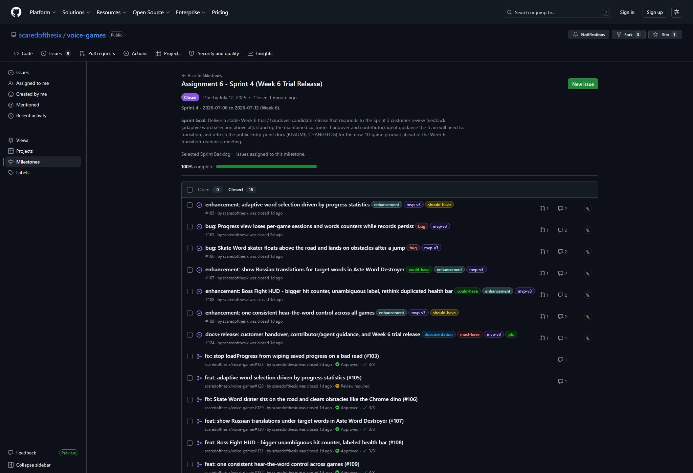
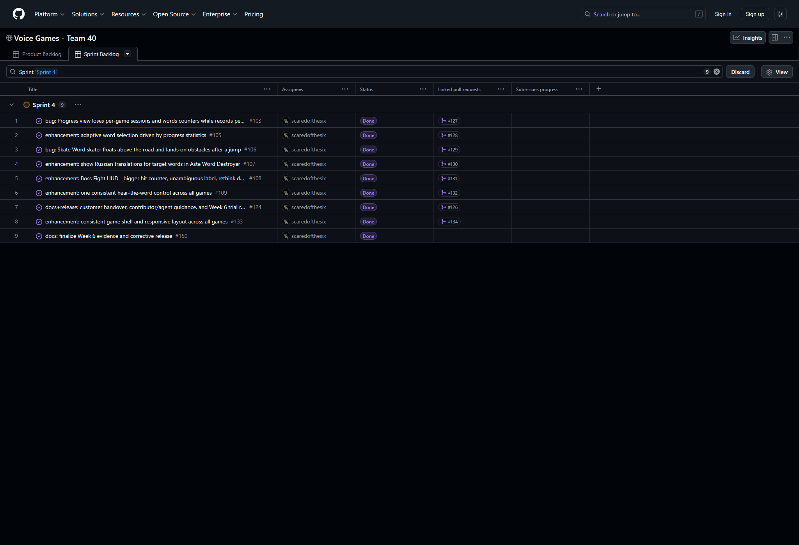
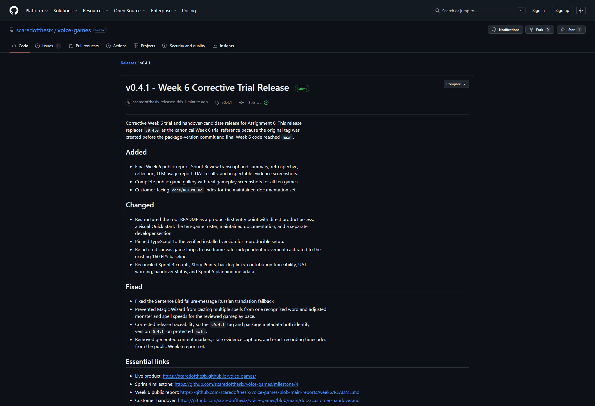
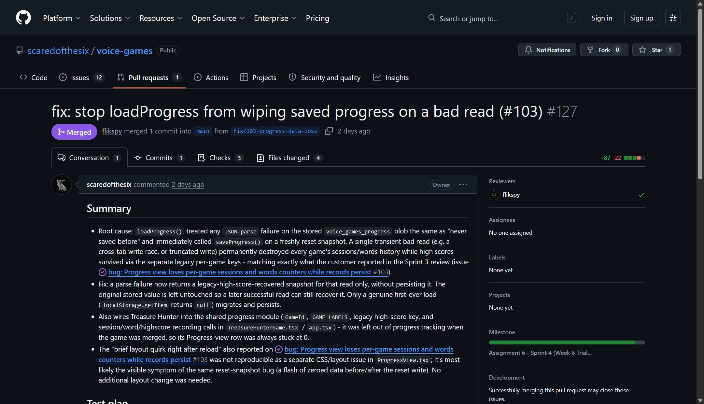

# Week 6 report - Assignment 6, Sprint 4 (Team 40)

**Project:** Voice Games - a browser-based, voice-controlled English-learning app for
children (Team 40).

## Sprint 4 - Week 6 trial release

- **Product Backlog board:** https://github.com/users/scaredofthesix/projects/1/views/1
- **Sprint 4 Backlog board:** https://github.com/users/scaredofthesix/projects/1/views/3
  (the `Sprint 4` group is the selected Sprint Backlog view).
- **Sprint 4 milestone:** https://github.com/scaredofthesix/voice-games/milestone/4 (16
  completed items, 0 open, closed on schedule on 2026-07-12).
- **Sprint Goal:** Deliver a stable Week 6 trial / handover-candidate release that responds
  to the Sprint 3 customer review feedback (adaptive word selection above all), stand up the
  maintained customer-handover and contributor/agent guidance the team will need for
  transition, and refresh the public entry-point docs ahead of the Week 6
  transition-readiness meeting.
- **Sprint dates:** 2026-07-06 to 2026-07-12.
- **Total Sprint 4 size:** 37 Story Points (issues #103, #105, #106, #107, #108, #109,
  #124, #133, and #150).

## Week 6 trial-release summary

[Release `v0.4.1`](https://github.com/scaredofthesix/voice-games/releases/tag/v0.4.1)
completes the ten-game roster with the four games merged just before Sprint 4 planning
(Voice Treasure Hunter, Magic Wizard, Sentence Bird, Echo Microphone), and adds:

- Adaptive word selection driven by progress statistics, so struggled words repeat more
  often (#105, PR #128) - the customer's main Sprint 3 request.
- A fix for a critical progress data-loss bug where a bad `localStorage` read could wipe
  saved progress (#103, PR #127).
- A shared game-UI kit unifying setup screens, hub navigation, the microphone indicator, and
  target-word cards across all 10 games (#133, PR #134; further unification in PR #137).
- Game-specific polish from the Sprint 3 review: Skate Word ground/jump physics (#106),
  Aste Word Destroyer Russian translations (#107), Boss Fight HUD clarity (#108), and one
  consistent hear-the-word control across games (#109).
- The maintained handover documentation set: `docs/customer-handover.md`, `CONTRIBUTING.md`,
  `AGENTS.md`, refreshed `README.md` and `CHANGELOG.md` (#124, PR #126).

`main` is green at the corrective release commit: TypeScript check, 13 test files / 99
tests, coverage gates, production build, Lighthouse, and the Lychee link check all pass.

## Access and documentation links

- [README.md](../../README.md)
- [CONTRIBUTING.md](../../CONTRIBUTING.md)
- [AGENTS.md](../../AGENTS.md)
- [docs/customer-handover.md](../../docs/customer-handover.md)
- [Hosted documentation site](https://scaredofthesix.github.io/voice-games/docs/)
- [docs/roadmap.md](../../docs/roadmap.md)
- [Run, verification, and deployment instructions](../../README.md#setup-and-deployment)
- [CHANGELOG.md](../../CHANGELOG.md)
- [UAT scenarios and execution history](../../docs/user-acceptance-tests.md)
- [Testing strategy](../../docs/testing.md)
- [Quality requirements](../../docs/quality-requirements.md)
- [Quality requirement tests](../../docs/quality-requirement-tests.md)
- [Architecture documentation](../../docs/architecture/README.md)
- [Development process](../../docs/development-process.md)
- **Week 6 product access:** live build at https://scaredofthesix.github.io/voice-games/,
  and the tagged release: https://github.com/scaredofthesix/voice-games/releases/tag/v0.4.1

## Customer-facing documentation review

The customer reviewed `README.md`, `CONTRIBUTING.md`, `AGENTS.md`, `CHANGELOG.md`, and
`docs/customer-handover.md` live during the meeting (full detail in
[`sprint-review-transcript.md`](./sprint-review-transcript.md), Part 3).

**Found clear / accepted as-is:** `CONTRIBUTING.md`'s setup workflow, Definition of Done, and
code conventions; `AGENTS.md`; the `CHANGELOG.md` being current; the MIT license; and the
facts in `docs/customer-handover.md` (no secrets required, repository ownership, access
model).

**Found unclear or in need of restructuring, not factually wrong:** `README.md` mixes
product-facing and developer-facing content in one flat document, buries the live-product
link, and still carries coursework wording ("Assignment 6", "Sprint 3") that should not be in
a document a future non-team maintainer reads. The customer specified an exact requested
order: live-product link, game list, two representative screenshots, hosted-docs link, then a
"For Developers" section (Repository Layout, Tech Stack, Setup and Deployment, License).
The customer also asked for a `docs/README.md` (renamed from `docs/index.md`) to index the
`docs/` directory, and a short visual Quick Start showing how to add a custom word.

**Found missing:** a way to bulk-add custom words instead of one at a time; an explicit,
pinned TypeScript version in `package.json` (the team's verbal answer at the meeting,
"7.0.2", does not match `package.json`'s `~5.8.2` - this needs reconciling before pinning).

All of the above became [issue #146](https://github.com/scaredofthesix/voice-games/issues/146)
(README/docs restructuring and TypeScript-version reconciliation). The documentation part of
this feedback was addressed immediately as part of the Week 6 public-entry-point polish: the
`README.md` was restructured to the customer's requested order (live-product link, ten-game
list, screenshots, a custom-word Quick Start, hosted-docs and handover links, then a "For
Developers" section), a `docs/README.md` directory index was added, coursework/internal-mirror
wording was removed, and the TypeScript version was pinned to the actual `5.8.3` (the "7.0.2"
stated verbally at the meeting did not match the repository and was reconciled to what is
really installed). `#146` is closed; the remaining Week 6 feedback is the game and cross-game
work tracked for Sprint 5.

## Transition-readiness summary

The customer's own assessment at the end of the meeting: "The product is almost ready. A few
things need to be fixed, and then it will be in good shape." Specifically:

- **Ready:** public access (GitHub Pages, no account/install needed), continuous deployment
  on merge to `main`, progress export (CSV downloaded successfully), hub navigation, Russian
  interface, repository ownership arrangement (team keeps ownership, customer does not need
  write access), and the overall documentation set's factual content.
- **Needs changes before Week 7 transition confirmation:** the Sentence Bird, Echo
  Microphone, and Magic Wizard issues found live during UAT (see below); confirming adaptive
  word selection is dynamic within a round, not just between rounds; bulk custom-word import;
  audio not stopping when switching games; internationalizing the preview screen. (The
  README/docs restructuring the customer asked for was completed during Week 6 finalization,
  see #146.)
- The customer explicitly accepted the plan to fix these items and present the result in
  Week 7 as sufficient for now; see `docs/customer-handover.md`'s handover-status table for
  the resulting interim `Accepted with follow-up items` status (final Part 8 confirmation is
  a Week 7 activity).
- **Use and operation evidence:** the customer executed UAT during a guided Week 6 session.
  Independent use outside that session was not confirmed. The product was not deployed or
  operated on the customer side. The team-operated public GitHub Pages deployment remains
  the agreed access arrangement, and customer-side deployment was not requested.

## Customer feedback response table

| Feedback point | Resulting issue | Status |
|---|---|---|
| Sentence Bird: contrast, silence handling, timer/lose animation, push-to-talk mic activation | [#140](https://github.com/scaredofthesix/voice-games/issues/140) | Open, Sprint 5 |
| Echo Microphone: restore memory mechanic, fix short-phrase card bug, brighten hub button | [#141](https://github.com/scaredofthesix/voice-games/issues/141) | Open, Sprint 5 |
| Magic Wizard: hitbox bug, timer visibility, decide overlap with Treasure Hunter | [#142](https://github.com/scaredofthesix/voice-games/issues/142) | Open, Sprint 5 |
| Adaptive word selection: dynamic within-round reweighting, algorithm tests | [#143](https://github.com/scaredofthesix/voice-games/issues/143) | Open, Sprint 5 |
| Bulk custom-word import (multiline, `\|`/`;` delimiter) | [#144](https://github.com/scaredofthesix/voice-games/issues/144) | Open, Sprint 5 |
| Stop audio on hub/game switch; internationalize preview screen; keep CSV in English | [#145](https://github.com/scaredofthesix/voice-games/issues/145) | Open, Sprint 5 |
| README/docs restructuring; reconcile and pin TypeScript version; implementer/accountable-reviewer process note | [#146](https://github.com/scaredofthesix/voice-games/issues/146) | Done (Week 6 finalization) |
| Progress-view lost counters | [#103](https://github.com/scaredofthesix/voice-games/issues/103) | Closed, Sprint 4 |
| Adaptive word selection (initial implementation) | [#105](https://github.com/scaredofthesix/voice-games/issues/105) | Closed, Sprint 4 (dynamism re-verified as #143) |
| Skate Word ground/jump physics | [#106](https://github.com/scaredofthesix/voice-games/issues/106) | Closed, Sprint 4 |
| Aste Word Destroyer Russian translations | [#107](https://github.com/scaredofthesix/voice-games/issues/107) | Closed, Sprint 4 |
| Boss Fight HUD clarity | [#108](https://github.com/scaredofthesix/voice-games/issues/108) | Closed, Sprint 4 |
| Consistent hear-the-word control | [#109](https://github.com/scaredofthesix/voice-games/issues/109) | Closed, Sprint 4 |
| CSV export readable columns | [#104](https://github.com/scaredofthesix/voice-games/issues/104) | Completed during Week 6, tracked in Sprint 5 (PR #137) |

## Feedback not yet addressed

Every Week 6 feedback point has a tracked issue; none were left untracked. The documentation
feedback (#146: README/docs restructuring, `docs/README.md`, TypeScript-version pin, and the
implementer/accountable-reviewer process note in `CONTRIBUTING.md`) was completed during Week
6 finalization and is closed. The remaining points - the game defects and cross-game UX work
in #140-#145 - are open in the Sprint 5 milestone and are not fixed yet; that work starts
after this submission, per the Sprint 4/Sprint 5 boundary.

## UAT / customer-trial results

| UAT | Scenario | Result | Notes |
|---|---|---|---|
| UAT-09 | Voice Treasure Hunter | Pass | Money counter increased with correct pronunciation, confirmed live. |
| UAT-10 | Sentence Bird | Issues found | Text/background contrast bug; continuous listening scores unrelated speech as wrong; game-over flow not as expected. See #140. |
| UAT-11 | Echo Microphone | Pass, with one issue | Target phrase visible on screen undermines the memory mechanic; short-phrase word sets produced 3 cards for 1 phrase. See #141. |
| UAT-12 | Magic Wizard | Issues found | Spell-cast hitbox problems; customer flagged mechanic overlap with Voice Treasure Hunter. See #142. |
| UAT-13 | Adaptive word selection | Inconclusive | Could not confirm live whether selection is dynamic within the current round; team acknowledged the behavior was unverified. See #143. |
| UAT-14 | Unified hub navigation | Pass with issue | Both tested games returned to the hub via the same button; audio from the previous game was still audible after switching (see #145). |

Full detail and quotes are in
[`sprint-review-transcript.md`](./sprint-review-transcript.md). This session's UAT execution
is also recorded in `docs/user-acceptance-tests.md`'s execution history.

## Sprint Review

- Sprint Review transcript:
  [reports/week6/sprint-review-transcript.md](./sprint-review-transcript.md) (publication
  explicitly permitted by the customer at the start of the session).
- [reports/week6/sprint-review-summary.md](./sprint-review-summary.md)

## Retrospective, reflection, LLM usage

- [reports/week6/retrospective.md](./retrospective.md)
- [reports/week6/reflection.md](./reflection.md)
- [reports/week6/llm-report.md](./llm-report.md)

## Current product status and expected Week 7 follow-up

`v0.4.1` is live with all ten games, adaptive word selection, and unified UI/hub navigation.
The customer confirmed the product is close to transition-ready but identified concrete
defects in three of the newest games plus documentation and usability follow-ups (see the
feedback table above). The documentation follow-up (#146) was already completed during Week 6
finalization. Sprint 5 (Week 7) will fix issues #140-#145, re-verify the adaptive
word-selection feature's in-round dynamism with automated tests, get the still-unreviewed
adaptive-word-selection PR (#128) reviewed by a second person, cut the final `MVP v3`
release, and run the Week 7 final-transition confirmation against `docs/customer-handover.md`.

## Contribution traceability

| Team member | Issues | PRs | Review | Testing / docs / deployment |
|---|---|---|---|---|
| scaredofthesix (Maxim) | #103, #105, #106, #107, #108, #109, #124, #133, #150 (author/assignee) | #126, #127, #128, #129, #130, #131, #132, #134, #137, #151, #152 | Reviewed/approved #118, #122, #123, #135, #136 | Authored `docs/customer-handover.md`, `CONTRIBUTING.md`, `AGENTS.md`, README refresh; verified lint/tests/build; wrote and reconciled this report from the session transcript and live GitHub evidence |
| Kotumbaa | #115, #116 (pre-Sprint-4 new games) | #119, #122, #123, #138 (release documentation), #139 (version bump and 160 FPS refactor) | Reviewed/approved #129, #130, #131, #132, #134, #137 | Release preparation and code review |
| flikspy | - | #120, #121 (pre-Sprint-4 new games), #135, #136 (Sentence Bird rework, Echo Microphone word-set picker) | Reviewed/approved #127 | Progress-loss fix review |
| MMavInno | Product Backlog refinement for Sprint 4 and the Sprint 5 follow-up scope; facilitated the Week 6 customer session (Sprint Review, customer-executed UAT, documentation review, transition discussion) | - | Reviewed/approved #138, #139 | Ran the recorded customer session and screen-share |
| TeraloToxin | - | - | Reviewed/approved #126 | Review of the customer-handover documentation set (`docs/customer-handover.md`, `CONTRIBUTING.md`, `AGENTS.md`, README) |

## Evidence screenshots

**Sprint 4 milestone** - Sprint Goal, dates, and all selected work complete. The live
milestone is closed with 16 completed items and 0 open items.

The Sprint 4 Backlog on the GitHub Projects board (Sprint Backlog view, grouped by Sprint) -
the Sprint 4 group shows each item with its assignee, `Done` status, and linked pull request.

**`v0.4.1` Week 6 corrective trial release** - tagged on the protected default branch,
with package metadata matching the tag and links to the Sprint 4 milestone,
`docs/customer-handover.md`, this report, and run instructions.

**Example reviewed, issue-linked PR (#127)** - merged into `main`, linked to issue #103,
approved by a second reviewer, with CI checks green.

**Week 6 trial build (`v0.4.1`)** - the hub now lists all ten games.

**The four pre-Sprint-4 games first included in the Week 6 trial release** - Voice Treasure
Hunter, Sentence Bird, Echo Microphone, and Magic Wizard, all playable with voice input:

| Voice Treasure Hunter | Sentence Bird |
|---|---|
|  |  |
| **Echo Microphone** | **Magic Wizard** |
|  |  |

**Adaptive word selection and progress export** - the Progress view with per-game statistics
and the CSV export teachers can download:

