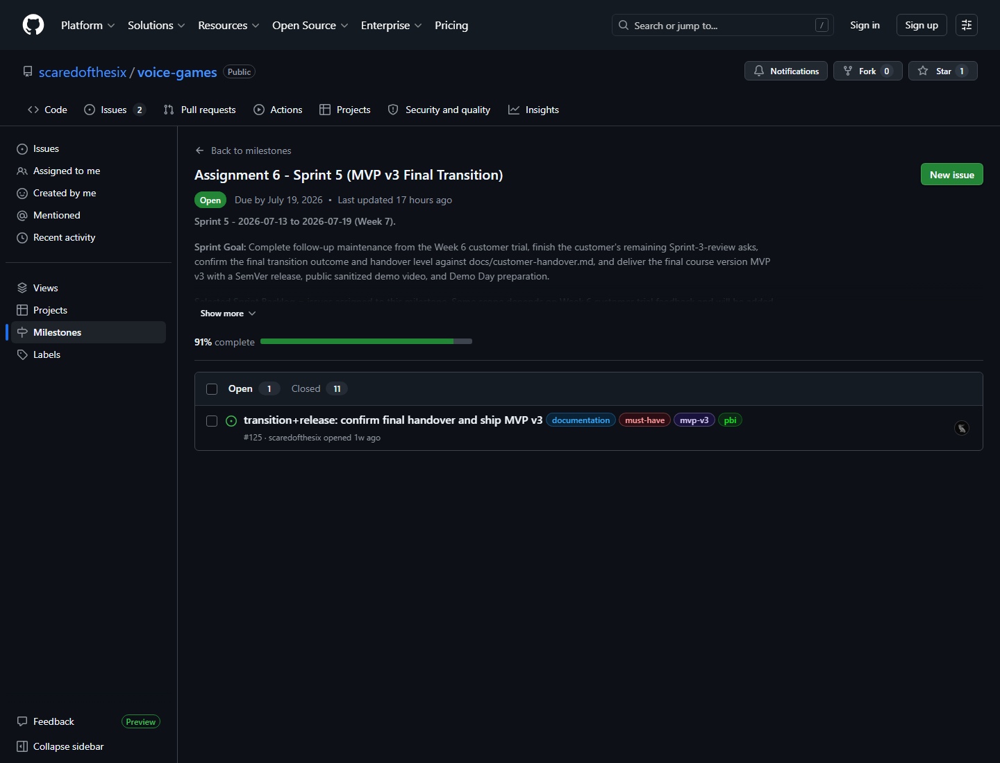
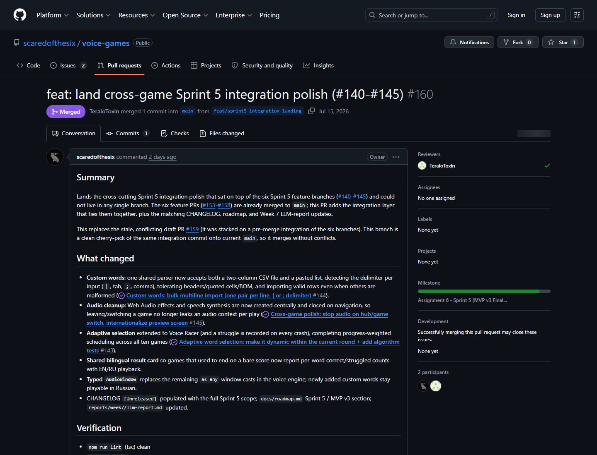
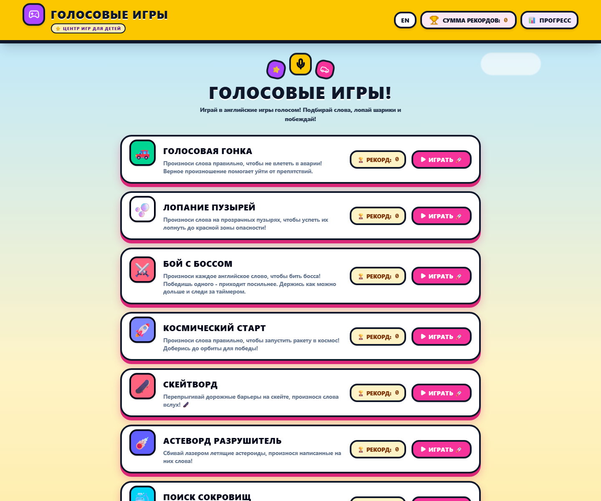
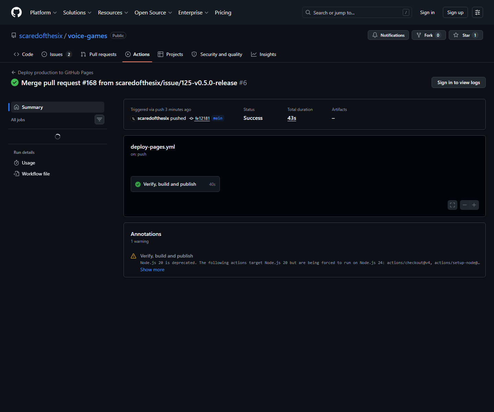
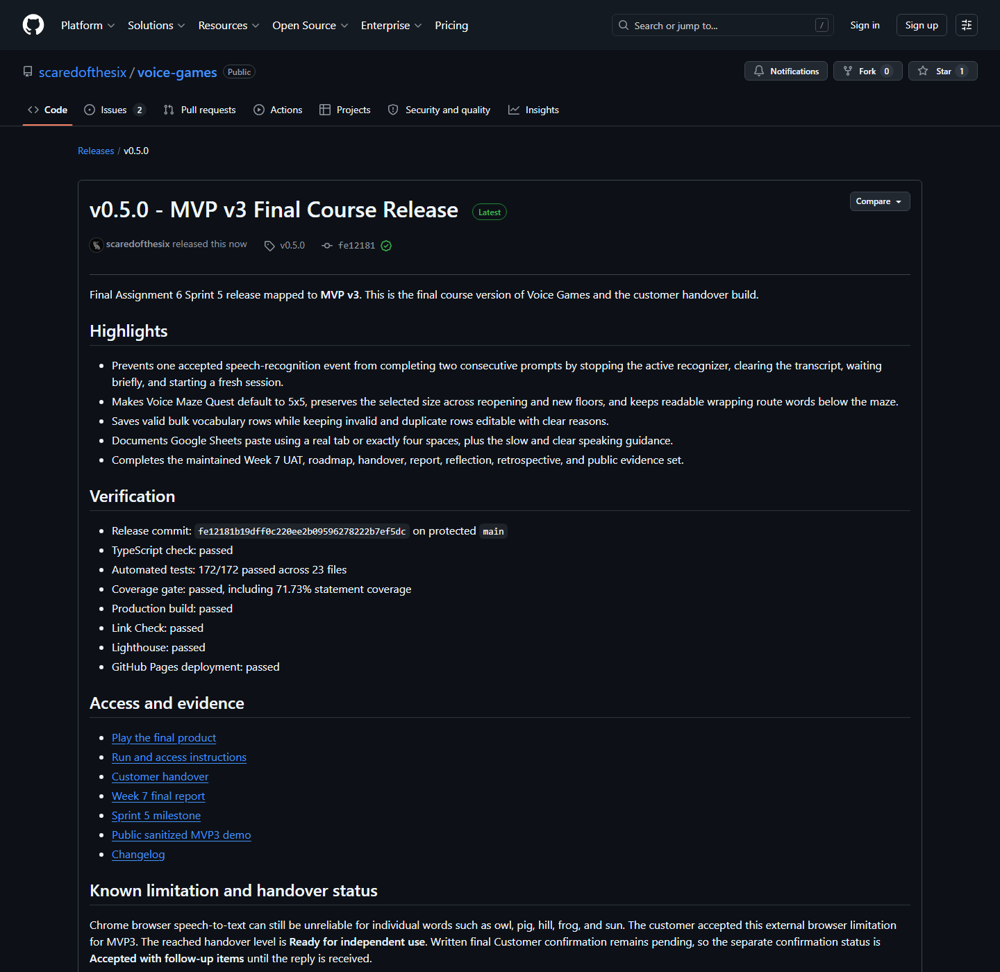

# Week 7 report - Assignment 6, Sprint 5 (Team 40)

> **Status: MVP V3 RELEASED, CUSTOMER CONFIRMATION PENDING.**
> The 2026-07-17 customer review is complete: revised
> UAT-12, UAT-13, and UAT-15 passed. The requested follow-up fixes were independently
> reviewed in PR #167, merged to protected `main`, and deployed successfully to GitHub Pages.
> CI and the public demo are green. The final
> [`v0.5.0` release](https://github.com/scaredofthesix/voice-games/releases/tag/v0.5.0)
> is published from protected `main`. Written customer confirmation remains pending and is
> not reported as complete.

**Week 6 report (full context, evidence, and process detail):** [reports/week6/README.md](../week6/README.md)

## Sprint 5 - final MVP v3 and transition

- **Product Backlog board:** https://github.com/users/scaredofthesix/projects/1
- **Sprint 5 Backlog board (Project view):** https://github.com/users/scaredofthesix/projects/1 (filter `Sprint = Sprint 5`)
- **Sprint 5 milestone:** https://github.com/scaredofthesix/voice-games/milestone/5
- **Milestone status:** Closed at 100% completion (12 closed issues, 0 open).
- **Sprint Goal:** Complete follow-up maintenance from the Week 6 customer trial, finish the
  customer's remaining Sprint-3-review asks, confirm the final transition outcome and
  handover level against `docs/customer-handover.md`, and deliver the final course version
  MVP v3 with a SemVer release, public sanitized demo video, and Demo Day preparation.
- **Sprint dates:** 2026-07-13 to 2026-07-19.
- **Total Sprint 5 size:** 49 Story Points (issues #104, #125, #140-#146).

## Week 7 follow-up and MVP v3 summary

Sprint 5 turned the Week 6 trial feedback into the final ten-game product. The initial fixes
for all six Week 6 follow-up issues were reviewed by a second team member and merged to the
protected `main` branch, followed by a cross-cutting integration pass. A final #142 follow-up
then addressed the customer's deeper gameplay-overlap concern before the Week 7 review:

- **Sentence Bird** (#140, PR #157): three hearts, a visible per-word timer, a defeat fall
  animation, high-contrast active word, and push-to-talk mic activation; unrelated speech no
  longer costs a life.
- **Echo Microphone** (#141, PR #153): the memory mechanic is restored - sequence words show
  during teaching playback then flip to hidden cards for recall - each recognized phrase is
  consumed once, and the hub button is brightened.
- **Voice Maze Quest + Treasure Hunter** (#142, PR #158, PR #162, and the final review
  follow-up): Treasure Hunter keeps its timed submarine-and-chest loop. The rejected Magic
  Wizard mechanic was replaced by Voice Maze Quest, with generated 5x5, 7x7, and 9x9
  labyrinths, spoken route choices, crystals, an avoidable hazard, a locked portal, and
  endless random floors.
- **Adaptive word selection** (#143, PR #155): progress-weighted scheduling now reacts to
  in-round struggles, with a seeded distribution test suite; extended in integration to
  cover all ten games.
- **Bulk custom-word input** (#144, PR #154, extended in the final review branch): add many
  words at once by pasting two columns separated by a real tab or exactly four spaces. CSV
  file upload and ambiguous delimiter guessing are not part of the final workflow.
- **Cross-game polish** (#145, PR #156, extended in #160): audio (speech synthesis and
  generated sound effects) now stops centrally when leaving or switching a game; CSV export
  stays English; canvas previews localized.
- **Integration polish** (PR #160 and later review branches): central audio-context cleanup,
  adaptive selection extended to Voice Racer, a shared bilingual per-word result card, and
  consistent Hub, setup, pause, and result patterns across all ten games.

The second customer review passed Voice Maze Quest, adaptive word selection, and bulk custom
vocabulary. It requested a short recognition-processing gate, 5x5 default maze selection,
editable invalid rows, Google Sheets guidance, readable long route phrases, and a slow,
clear speaking tip. These changes are included in the reviewed and deployed `v0.5.0` build.

CSV-columns export (#104) landed earlier and is retained in Sprint 5 traceability.

## Access and documentation links

- [README.md](../../README.md)
- [CONTRIBUTING.md](../../CONTRIBUTING.md)
- [AGENTS.md](../../AGENTS.md)
- [docs/customer-handover.md](../../docs/customer-handover.md)
- [Repository documentation](../../docs/README.md)
- **Hosted documentation:** https://scaredofthesix.github.io/voice-games/docs/
- **Current access and run instructions:** [README Play now and setup guidance](../../README.md#play-now)
- **Final product access arrangement:** https://scaredofthesix.github.io/voice-games/
  The final reviewed build was published by the protected `main`
  [deployment workflow](https://github.com/scaredofthesix/voice-games/actions/runs/29583496693)
  on 2026-07-17.

## Final transition outcome

The customer completed the guided Week 7 review and agreed to provide a short written
acceptance confirmation after receiving the final release link. The release now exists and is
ready to send. Until the reply is received, the handover level remains **Ready for independent
use** and the confirmation status remains **Accepted with follow-up items**. No customer-side
deployment or operation was demonstrated.

## What was transferred, delegated, or retained

The product is a static browser app deployed publicly on GitHub Pages, with source, issues,
CI, and the hosted documentation site all public. The team currently retains the GitHub
repository and the internal Innopolis VM mirror; no private credentials or paid services are
required to run or host it. See [docs/customer-handover.md](../../docs/customer-handover.md)
for the authoritative, current transition scope. The customer did not request repository
write access or customer-side hosting during the Week 7 review.

## Remaining transition blockers, limitations, and support expectations

- Voice input requires Google Chrome (Web Speech API); this is a documented product
  limitation, not a defect.
- The final release link must be sent to the customer, followed by the agreed written
  acceptance confirmation.
- Chrome's browser speech-to-text can be unreliable for words such as *owl*, *pig*, *hill*,
  *frog*, and *sun*. The customer accepted this external limitation for MVP3 and recommended
  speaking slowly and clearly.

## Customer-independent use / deployment evidence

The customer opened the public GitHub Pages product in Chrome and operated it during the
guided review. This proves public access and hands-on use in the review, but it is not
evidence of independent use outside the session or customer-side deployment. The handover
level therefore remains **Ready for independent use**.

## Customer feedback response table (Sprint 5 follow-up)

| Customer feedback point | Issue | Sprint 5 resolution |
|---|---|---|
| Sentence Bird: contrast, silence handling, timer/lose animation, push-to-talk mic | [#140](https://github.com/scaredofthesix/voice-games/issues/140) | Merged (PR #157) |
| Echo Microphone: restore memory mechanic, short-phrase card bug, brighten hub button | [#141](https://github.com/scaredofthesix/voice-games/issues/141) | Merged (PR #153); UAT-11 passed with the documented browser STT limitation |
| Magic Wizard: hitbox bug, timer visibility, overlap with Treasure Hunter | [#142](https://github.com/scaredofthesix/voice-games/issues/142) | Magic Wizard replaced by Voice Maze Quest; revised UAT-12 passed on 2026-07-17 |
| Adaptive word selection: dynamic within-round reweighting + tests | [#143](https://github.com/scaredofthesix/voice-games/issues/143) | Merged (PR #155), extended to all ten games in PR #160 |
| Bulk custom-word input | [#144](https://github.com/scaredofthesix/voice-games/issues/144) | Tab and exactly-four-space paste passed UAT-15; invalid-row preservation and Google Sheets guidance added after review |
| Stop audio on hub/game switch; internationalize preview; keep CSV English | [#145](https://github.com/scaredofthesix/voice-games/issues/145) | Merged (PR #156); localized previews and shared Hub accepted in the Sprint Review |
| CSV export in readable columns | [#104](https://github.com/scaredofthesix/voice-games/issues/104) | Closed (PR #137, Week 6) |
| Final review: duplicate recognition, 5x5 default, editable invalid rows, Google Sheets guidance, readable route phrases, slow-speaking tip | [#125](https://github.com/scaredofthesix/voice-games/issues/125) | Independently reviewed and merged in [PR #167](https://github.com/scaredofthesix/voice-games/pull/167); shipped in [v0.5.0](https://github.com/scaredofthesix/voice-games/releases/tag/v0.5.0) with green deployed-product and automated evidence |

Additional 2026-07-17 feedback is recorded in
[sprint-review-summary.md](./sprint-review-summary.md) and the dated `v0.5.0` changelog entry.

## UAT / customer-trial results (Week 7)

Maintained UAT scenarios: [docs/user-acceptance-tests.md](../../docs/user-acceptance-tests.md).
The customer passed revised UAT-12 and UAT-13 and passed UAT-15 with small usability
follow-up items. UAT-14 had passed earlier and the shared Hub remained correct. Progress and
Clear Progress were also rechecked successfully. See the execution history in the maintained
UAT document.

## Release and demo video

- **Final SemVer release (MVP v3):**
  [v0.5.0 - MVP v3 Final Course Release](https://github.com/scaredofthesix/voice-games/releases/tag/v0.5.0)
  (published from protected `main` commit `fe12181` on 2026-07-17).
- [CHANGELOG.md](../../CHANGELOG.md)
- **Public sanitized demo video:** [MVP3 v0.5.0 gameplay demo](https://disk.yandex.ru/i/xfaSgCVd2CijnA)
  (public view and product-only content verified on 2026-07-17; duration 1:52.5).

## Demo Day preparation

The final Demo Day deck, speaker timing plan, and the 1:52.5 public product demo are prepared.
The deck includes the MVP roadmap, exact 71.73% statement coverage, final handover status,
team contribution, known limitations, and the required public links. Speaker notes keep the
full sequence within seven minutes and include the Week 6 feedback to face the audience
instead of the screen. The live Week 7 rehearsal and Moodle upload are private submission
actions and are not claimed as completed until the team performs them. Presentation slides
and rehearsal recordings are not committed to the public repository.

## Sprint Review

- [Sanitized Sprint Review transcript, Parts 1 and 2, 2026-07-16 and 2026-07-17](./sprint-review-transcript.md)
- [Sprint Review and final MVP3 summary, 2026-07-16 and 2026-07-17](./sprint-review-summary.md)

Publication permission for the sanitized second-session transcript was confirmed after the
initial report was prepared. Personal names, private communication channels, and internal
access details were removed. Attendance and recording evidence remain in the private Week 7
Moodle submission.

## Retrospective, reflection, LLM usage

- [reports/week7/retrospective.md](./retrospective.md)
- [reports/week7/reflection.md](./reflection.md)
- [reports/week7/llm-report.md](./llm-report.md)

## Final product status

Ten voice-controlled English games share one UI shell, adaptive per-word scheduling,
bilingual EN/RU playback for built-in and custom words, and per-word practice reporting.
The reviewed `v0.5.0` build contains the final review fixes, is live on GitHub Pages, and has
a public sanitized demo. The local and protected-branch gates passed TypeScript checking,
172 automated tests across 23 files, coverage thresholds (71.73% statement coverage), the
production build, link checking, deployment, and Lighthouse on 2026-07-17. The final SemVer
release is published. Only written transition confirmation remains pending as described
above.

## Contribution traceability

| Team member | Issues / PRs authored | Review + merge | Testing | Docs / transition / release |
|---|---|---|---|---|
| scaredofthesix (Maksim Bodulev) | Sprint 5 fix PRs #153-#158, integration PR #160; issues #140-#145 and #125 follow-up implemented in PR #167; release preparation PR #168 | Prepared #167 and #168 for independent review; merged #168 after approval | Wrote adaptive/parser/game tests and ran the release quality gate | CHANGELOG, roadmap, Week 7 report, handover doc, public demo, v0.5.0 release orchestration |
| Kotumbaa | - | Reviewed + merged #153 (Echo), #155 (adaptive) | Live-tested Echo memory mechanic and adaptive repeats | - |
| flikspy | - | Reviewed + merged #154 (bulk import), #157 (Sentence Bird) | Live-tested import and mic push-to-talk | - |
| TeraloToxin | - | Reviewed + merged #156 (cross-game audio), #160 (integration), and #167 (final MVP3 review fixes); approved #168 (release preparation) | Live-tested audio stop on navigation and independently reviewed the final release build | - |
| MMavInno | - | Reviewed + merged #158 (Magic Wizard + Treasure Hunter) | Live-tested both canvas games | - |

_Demo Day materials and timing preparation are complete. Week 7 live rehearsal completion
remains unconfirmed and is not inferred from the public product demo._

## Evidence screenshots

**Closed Sprint 5 milestone (12 closed, 0 open, 100% complete):**

**Reviewed and merged issue-linked integration PR #160:**

**Final reviewed build deployed publicly through GitHub Pages:**

**Successful protected-branch production deployment for merged PR #167:**

**Published final SemVer release mapped to MVP v3:**

